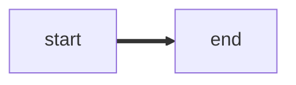
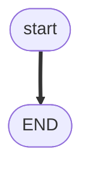

# Analysis

> Program: `{program-slug}`  
> Listing: [`../code/as-received.ls`](../code/as-received.ls)

Every JMP, LBL, IF, WAIT, SKIP, UALM, and CALL in `/MN` must appear below. Label **fact** vs **assumption**.

## Stated intent vs coded behavior

- Stated (intake):
- Coded:

## Happy path

Step through L# in order until END or ABORT.

## Branches, loops, jumps

| L# | Kind | What happens |
|----|------|----------------|
| | JMP / LBL / IF / WAIT TIMEOUT / SKIP / UALM / CALL | |

## Path / origin

If the TCP moves: spatial sketch (OFFSET: taught 1-2-3-4 then 1'-2'-3'-4'). Caption: study sketch; not millimetres.

## Program flow (L#)

One flowchart. Stadium start/END, diamond IF/WAIT/SKIP, parallelogram I/O, CALL subroutine shape. Happy path `==>`. Timeout/fault `-.->`.

## Block-by-block

| Lines | What it does | Atom |
|-------|----------------|------|
| 0 | | |

## Missing callees / data

- CALL programs not in the paste:
- Unmapped I/O:
- Untaught P[] / PR[]:

## Rights

FANUC retains all rights in its trademarks, software, and manuals. This pack is unofficial. Site SOP and licensed OEM manuals override it.
