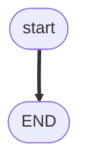
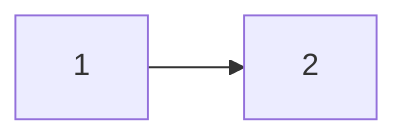

# Design

> Program: `{program-slug}`  
> Listing: [`../code/as-received.ls`](../code/as-received.ls)

Standalone. A reader who never opens 00–03 still understands this program: purpose, CALL shape, every branch, faults, cell surroundings that were given, and what was asked but not provided.

## Purpose

- Intended (intake):
- As coded:

## Architecture

CALL tree. What lives in this file vs missing callees.

```text
{MAIN}
  …
```

## Control flow

One L# flowchart (same rules as analysis). Cover JMP/LBL, loops, WAIT timeout, SKIP, UALM, ABORT, END.



## Path / origin

If motion: taught geometry vs OFFSET/INC. Not millimetres.



## I/O, registers, poses

| Kind | Index / name | Role in this listing | Known? |
|------|----------------|----------------------|--------|
| RI/RO/DI/DO | | | no unless intake |
| R[] / PR[] / P[] | | | |

## Cell surroundings

Facts from intake only. Do not invent.

| Topic | Fact |
|-------|------|
| EOAT / gripper | |
| Peripherals | |
| Backups (MD/USB, SRAM, FROM, auto) | |
| PNS / RSR / macros | |

## Asked, not provided

Rows still **unknown**. When answers arrive, regenerate 00 / 02 / 04 (and 03 if ranks change). Do not redraw the `/MN` flowchart unless the listing changed.

- …

## Failure modes

| Mode | How it happens | What the listing does |
|------|----------------|------------------------|
| Timeout | | |
| Skip | | |
| UALM / ABORT | | |
| Missing callee | | |

## Verdict (summary)

Copy the headline from `02-verdict.md`. Link facts vs assumptions.

## Suggestions (summary)

Recommended S# from `03-suggestions.md`. No implementation in this file.

## Open questions

From `intake.md` still unanswered.

## Related pack files

- [`00-before.md`](00-before.md)
- [`01-analysis.md`](01-analysis.md)
- [`02-verdict.md`](02-verdict.md)
- [`03-suggestions.md`](03-suggestions.md)

## Rights

FANUC retains all rights in its trademarks, software, and manuals. This pack is unofficial. Site SOP and licensed OEM manuals override it. Use at your own consent and risk.
