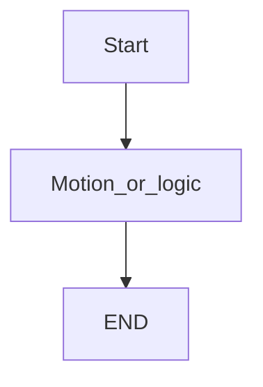
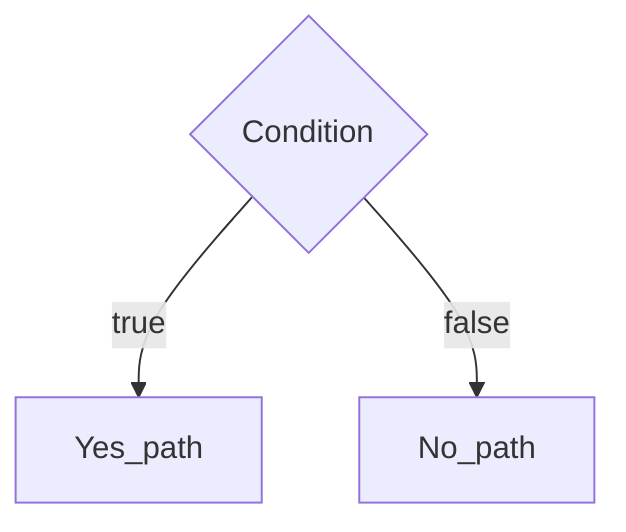

# {Program name} — guide

> Drill: `practice/fanuc/00N-slug/`  
> Code: `code/solution.ls`

## Purpose

One paragraph: what this listing does. Placeholders only.

## Flowchart

## Decisions (diamond)

If the program has no IF/WAIT/SKIP/UALM branch, say so and show a single path.

## Block-by-block

| Lines | What it does | Atom |
|-------|----------------|------|
| 0 | LEGAL remark | Remark |
| … | … | … |

## Safety

Prove in T1, then T2, then Auto. Site SOP and OEM manuals override this page. I/O and poses are placeholders. `/ATTR` size fields may be zero — study ASCII, not a backup.

## Rights

See [`LEGAL.md`](../../../../LEGAL.md): FANUC retains all rights. Educational use; own consent and risk.
