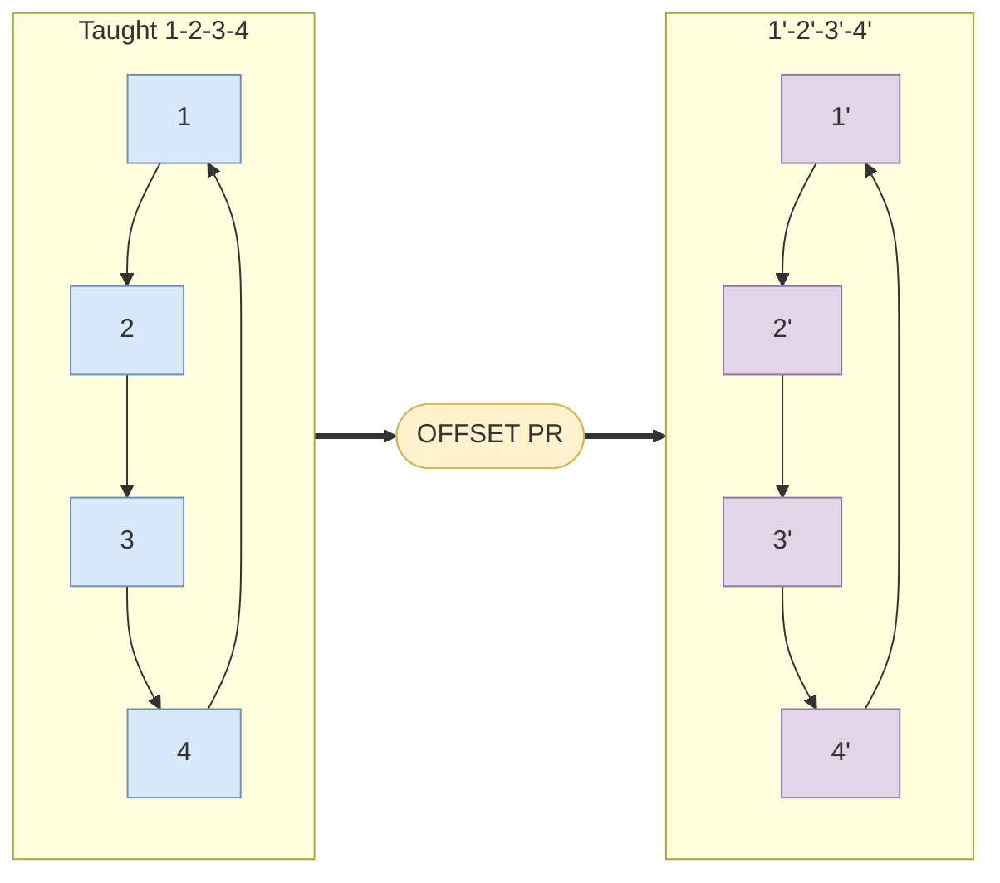

# {Topic title}

> Status: stub \| draft \| reviewed  
> Brand: FANUC  
> Mode: learner \| operator \| programmer \| integrator  
> Track: 01 HandlingTool  
> Practice: `practice/fanuc/...`

## Overview

What this is and why it matters.

## When to use

Bullet list of situations (and when not to).

## Definition

Precise terms.

## System

## Path / origin

When the topic **moves the TCP** (OFFSET, INC, frames, pallet, pick/place, skip, square), add a spatial Mermaid: taught **1-2-3-4** then OFFSET **1'-2'-3'-4'**, grid cells, or Joint vs Linear. Rule: [mermaid-path-origin](../../.cursor/rules/documentation/mermaid-path-origin.mdc). Skill: `fanuc-path-diagram`. Caption: study sketch; teach on the cell.

## Worked example

Short TP or pendant sequence. Link a practice id.

## Practice

- [`practice/fanuc/00N-slug/`](../../practice/fanuc/00N-slug/)

## Common mistakes

- ...

## Safety notes

- Site SOP and OEM manuals override this page.

## Official references

On manuals **licensed to your site**: the HandlingTool / operator chapter for this topic. Do not paste OEM pages here.

## Repo references

- Related articles
- Practice ids

## Rights

See [`LEGAL.md`](../../LEGAL.md): FANUC retains all rights. Educational use; own consent and risk.
