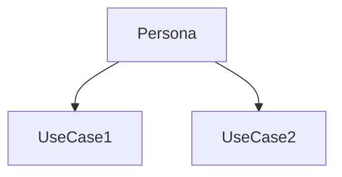
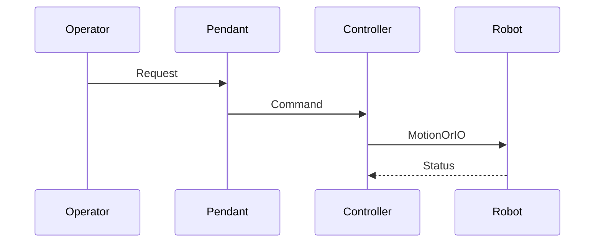

# {Topic title}

> Status: stub | draft | reviewed  
> Brand: FANUC  
> Personas: operator | programmer | integrator | student | notes-reviewer  
> Related programs: `programs/fanuc/...`

## Overview

One short paragraph: what this topic is and why it matters in a cell.

## Definition

Precise terms. Distinguish industrial arm vs collaborative robot when relevant.

## System

Block diagram of components and data/motion flow.

## Use cases

## Sequence

Use when the topic is a procedure (teach, recover, cycle).

## Safety notes

- Site procedures and OEM manuals override this page.
- Collaborative and industrial cells have different force, speed, and fencing rules.

## Official references

- FANUC operator / handling tool / DCS manuals (link only; do not paste copyrighted text): `[OFFICIAL_URL]`
- Controller software version: `[CONTROLLER_SOFT_VERSION]`

## Repo references

- Docs: `docs/fanuc/...`
- Programs: `programs/fanuc/...`
- Temp drafts: `temp/<skill-name>/`

## TODO

- Fill from reviewed notes in `inbox/pdf/` when available.
