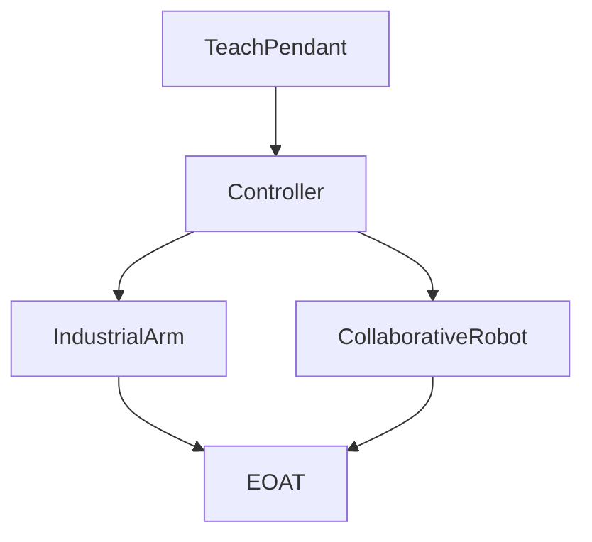

# Track 01 — FANUC HandlingTool

Articles plus a [practice set](../../practice/fanuc/). Map: [learning path](learning-path.md).

## Articles

| Area | Pages |
|------|--------|
| Path | [Learning path](learning-path.md), [topic map](topic-map.md) (atom vs union) |
| Arm | [Industrial](industrial-arm/overview.md) |
| Cobot | [Collaborative](collaborative/overview.md) |
| Controller | [Overview](controller-pendant/overview.md), [pendant](controller-pendant/teach-pendant.md), [backup](controller-pendant/backup-restore.md) |
| Frames / I/O | [Overview](io-frames-tools/overview.md), [frames](io-frames-tools/frames.md), [I/O](io-frames-tools/io-classes.md), [SOP/UOP](io-frames-tools/io-sop-uop.md), [SI/SO](io-frames-tools/io-safety-si-so.md), [P vs PR vs R](io-frames-tools/pr-vs-r.md) |
| Motion | [Overview](motion-paths-home/overview.md), [jog / recovery](motion-paths-home/jog-and-recovery.md) |
| Safety | [Overview](safety-dcs/overview.md), [T1 T2 Auto](safety-dcs/modes-t1-t2-auto.md) |
| Alarms | [Overview](alarms/overview.md) |
| TP | [Overview](programming-tp/overview.md), [identifiers](programming-tp/identifiers.md), [keywords](programming-tp/keywords.md), [J](programming-tp/motion-j.md), [L](programming-tp/motion-l.md), [J/L/C union](programming-tp/motion-types-fine-cnt.md), [offset/INC](programming-tp/offset-and-incremental.md), [JMP/LBL](programming-tp/logic-lbl-jmp.md), [SKIP](programming-tp/logic-skip.md), [remark](programming-tp/remark.md), [UALM](programming-tp/ualm.md), [MESSAGE](programming-tp/message.md), [override](programming-tp/override.md), [R[]](programming-tp/registers-numeric.md), [CALL](programming-tp/registers-jumps-call.md) |
| Applications | [Pick and place](applications/pick-and-place.md), [pallet grid](applications/pallet-grid.md), [skip and contour](applications/skip-and-contour.md) |
| Karel | [Overview](programming-karel/overview.md) (optional later) |

## Practice

[`practice/fanuc/`](../../practice/fanuc/) — problems `001`–`021` (`code/` + `doc/guide.md`).

## Sources

[`../sources.md`](../sources.md) · [`../glossary.md`](../glossary.md) · [`../jargons.md`](../jargons.md)

## Rights

See [`LEGAL.md`](../../LEGAL.md): FANUC retains all rights. Educational use; own consent and risk.
