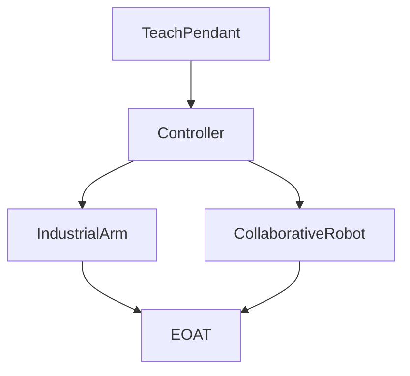

# Track 01 — FANUC HandlingTool

Articles plus a [practice set](../../practice/fanuc/). Map: [learning path](learning-path.md).

## Articles

| Area | Pages |
|------|--------|
| Course | [Learning path](learning-path.md) |
| Arm | [Industrial](industrial-arm/overview.md) |
| Cobot | [Collaborative](collaborative/overview.md) |
| Controller | [Overview](controller-pendant/overview.md), [pendant](controller-pendant/teach-pendant.md), [backup](controller-pendant/backup-restore.md) |
| Frames / I/O | [Overview](io-frames-tools/overview.md), [frames](io-frames-tools/frames.md), [I/O](io-frames-tools/io-classes.md) |
| Motion | [Overview](motion-paths-home/overview.md) |
| Safety | [Overview](safety-dcs/overview.md), [T1 T2 Auto](safety-dcs/modes-t1-t2-auto.md) |
| TP | [Overview](programming-tp/overview.md), [J/L/C](programming-tp/motion-types-fine-cnt.md), [offset/INC](programming-tp/offset-and-incremental.md), [logic](programming-tp/registers-jumps-call.md) |
| Karel | [Overview](programming-karel/overview.md) (optional later) |

## Practice

[`practice/fanuc/`](../../practice/fanuc/) — problems `001`–`008`.

## Sources

[`../sources.md`](../sources.md)

## Rights, education, and consent

FANUC retains **all rights** in its trademarks, software, and manuals. See [`LEGAL.md`](../../LEGAL.md).

This page and any linked programs are **educational and study-aid only**. Use at **your own consent and risk**. Garry TJ / this repo are not FANUC and offer no warranty.
