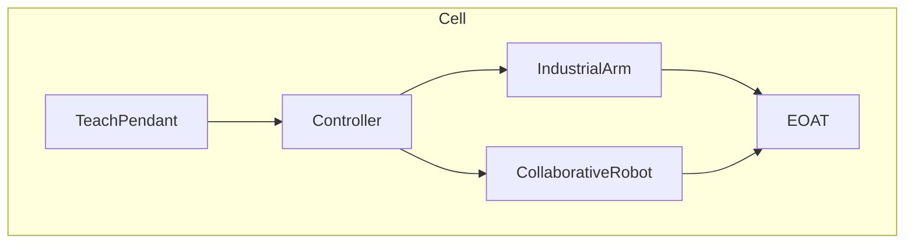

# FANUC topics

Index for industrial six-axis arms and collaborative robots (CRX class). Stubs: fill from manuals and later `inbox/pdf/` notes. Do not paste copyrighted OEM text.

## Topic tree

| Area | Page | Status |
|------|------|--------|
| Industrial arm | [Overview](industrial-arm/overview.md) | stub |
| Collaborative | [Overview](collaborative/overview.md) | stub |
| Controller and pendant | [Overview](controller-pendant/overview.md) | stub |
| I/O, frames, tools | [Overview](io-frames-tools/overview.md) | stub |
| Motion, paths, home | [Overview](motion-paths-home/overview.md) | stub |
| Safety and DCS | [Overview](safety-dcs/overview.md) | stub |
| Programming TP | [Overview](programming-tp/overview.md) | stub |
| Programming Karel | [Overview](programming-karel/overview.md) | stub |

## Programs

See [`../../programs/fanuc/`](../../programs/fanuc/).
