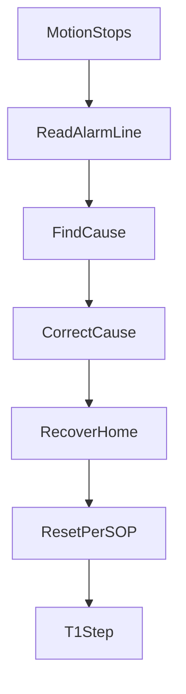

# Alarms, faults, and Reset

> Status: reviewed  
> Brand: FANUC  
> Mode: operator, programmer, learner  
> Track: 01 HandlingTool  
> Practice: `practice/fanuc/007-wait-gripper`, `practice/fanuc/009-fault-home`

## Overview

An **alarm** is the controller telling you it will not (or should not) continue. Study the **code + message**, then the **cause**, then recover. Reset without understanding is how cells get damaged.

This page is a study map, not the alarm encyclopedia. Look up the exact code in the manuals for **your software version**.

## When to use

- Pendant shows a fault and motion stopped
- A TP program fires `UALM[]` on a timeout
- You are writing a handshake and need a failure path (UALM, ABORT, or JMP to recovery)

## Definition

Rough families you will see in class and on cells (names vary by version):

| Family | Typical meaning (study level) |
|--------|-------------------------------|
| **SRVO** | Servo / axis / hardware side |
| **INTP** | Interpreter / program / instruction |
| **USER / UALM** | Program-raised user alarm |
| **SYST / FILE / COMM** | System, storage, communications |

**Pause vs ABORT vs fault:** Pause can often resume the same line after a safe check. ABORT ends the program. A servo fault usually needs Reset (and often a recover-to-home) before any Auto start.

**Reset** is not “make it safe.” It only clears a latched condition the controller is willing to clear.

## System

## Worked example

Gripper timeout in [`007-wait-gripper`](../../../practice/fanuc/007-wait-gripper/): `WAIT RI[] TIMEOUT` → `UALM[1]` → `ABORT`. Atom: [`ualm.md`](../programming-tp/ualm.md), [`020`](../../../practice/fanuc/020-user-alarm/). On a real cell, `UALM[1]` text is configured by the integrator. After the EOAT is safe:

1. Do not Auto-start.
2. Jog or run [`009-fault-home`](../../../practice/fanuc/009-fault-home/) at low Joint override to a taught home.
3. Fix the handshake (valve, sensor, I/O map).
4. T1 step the wait again.

Alarm History (Status menus — labels vary) is for **what happened**, not a substitute for the code description in the OEM alarm list.

## Practice

- [`007-wait-gripper`](../../../practice/fanuc/007-wait-gripper/) — program-raised alarm
- [`009-fault-home`](../../../practice/fanuc/009-fault-home/) — recover pose after a understood stop

## Common mistakes

- Reset loop: same SRVO returns immediately
- Continuing Auto after a collision alarm
- Copying an alarm number from this repo as if it were your cell
- Treating `UALM` as optional decoration — operators need a readable message

## Safety notes

Fence, e-stop, and DCS trips are safety events. Follow lockout and SOP. This guide does not authorize bypasses.

## Official references

On manuals **licensed to your site**: alarm code list for your controller software, Recovery / fault reset, User Alarm setup. Do not paste those lists into the repo.

## Repo references

- [`../motion-paths-home/jog-and-recovery.md`](../motion-paths-home/jog-and-recovery.md)
- [`../safety-dcs/modes-t1-t2-auto.md`](../safety-dcs/modes-t1-t2-auto.md)
- [`../programming-tp/registers-jumps-call.md`](../programming-tp/registers-jumps-call.md)

## Rights, education, and consent

FANUC retains **all rights** in its trademarks, software, and manuals. See [`LEGAL.md`](../../../LEGAL.md).

This page and any linked programs are **educational and study-aid only**. Use at **your own consent and risk**. Garry TJ / this repo are not FANUC and offer no warranty.
