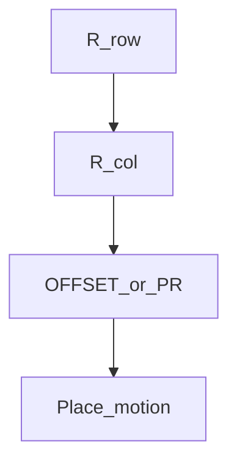

# Pallet grid (union)

> Status: reviewed  
> Brand: FANUC  
> Mode: programmer, learner  
> Track: 01 HandlingTool  
> Practice: `practice/fanuc/018-pallet-grid`

## Overview

A **pallet** is a grid of placements. You union **R[] loops** (row, col) with **displacement** (OFFSET CONDITION and/or PR element offsets), not twenty copied P[] unless you mean to. Atoms: [`../programming-tp/registers-numeric.md`](../programming-tp/registers-numeric.md), [`../io-frames-tools/pr-vs-r.md`](../io-frames-tools/pr-vs-r.md), [`../programming-tp/offset-and-incremental.md`](../programming-tp/offset-and-incremental.md).

## When to use

- Nested parts, trays, uniform pitch
- Not for: mixing INC and OFFSET on the same square until you can sketch it
- Not for: real tray pitch copied from this repo

## Definition

Use **R[1]** as row (0 .. nRows-1), **R[2]** as col (0 .. nCols-1). Placeholder pitch **dx, dy** (and optional **dz** for layer).

Study math (teach X0, Y0, dx, dy on the cell — do not copy millimetres from this repo):

```text
X = X0 + col * dx
Y = Y0 + row * dy
Z = Z0 + layer * dz    (optional)
index = row * nCols + col
```

Write X/Y into a **PR** (element numbers: confirm X=1, Y=2 on your software) then OFFSET CONDITION or Offset on Linear. See [`018`](../../../practice/fanuc/018-pallet-grid/) `code/solution.ls` and [`doc/guide.md`](../../../practice/fanuc/018-pallet-grid/doc/guide.md).

## System



## Worked example

[`018-pallet-grid`](../../../practice/fanuc/018-pallet-grid/). Simpler OFFSET path: [`005-offset-path`](../../../practice/fanuc/005-offset-path/).

## Practice

[`018-pallet-grid`](../../../practice/fanuc/018-pallet-grid/)

## Common mistakes

- Off-by-one on row/col
- OFFSET with the wrong UFRAME
- Infinite JMP

## Safety notes

First cell at low T1 override. Site SOP and OEM manuals override this page.

## Official references

On manuals **licensed to your site**: OFFSET CONDITION, registers. Do not paste OEM pages here.

## Repo references

- [`pick-and-place.md`](pick-and-place.md)
- [`../topic-map.md`](../topic-map.md)

## Rights

See [`LEGAL.md`](../../../LEGAL.md): FANUC retains all rights. Educational use; own consent and risk.
