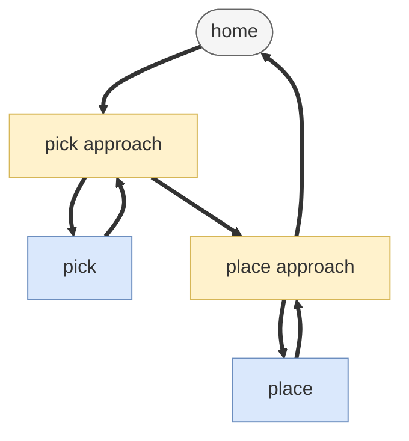
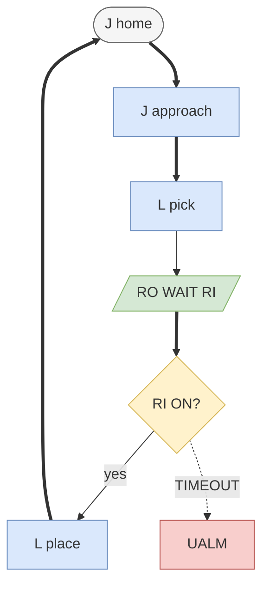

# Pick and place (union)

> Status: reviewed  
> Brand: FANUC  
> Mode: programmer, learner  
> Track: 01 HandlingTool  
> Practice: `practice/fanuc/017-pick-place`

## Overview

A handling cycle **unions** Joint fly-over, Linear to the part, EOAT I/O, retreat, place, and home. Atoms: [`../programming-tp/motion-j.md`](../programming-tp/motion-j.md), [`../programming-tp/motion-l.md`](../programming-tp/motion-l.md), [`../io-frames-tools/io-classes.md`](../io-frames-tools/io-classes.md).

## When to use

- Study a full pick → place → home before writing a cell main
- Not for: commissioned payload, real I/O maps, or Auto without T1/T2

## Definition

Typical skeleton: J approach → L pick → RO/WAIT RI → L retreat → J to place approach → L place → release → retreat → J home. All indexes are placeholders.

## Path / origin

Study sketch. Heights: fly **approach**, Linear **down** to pick/place, retreat, then the other nest. Not millimetres.

## System

## Worked example

[`017-pick-place`](../../../practice/fanuc/017-pick-place/). Timeout style: [`007-wait-gripper`](../../../practice/fanuc/007-wait-gripper/).

## Practice

[`017-pick-place`](../../../practice/fanuc/017-pick-place/)

## Common mistakes

- Linear from home through the fixture
- Gripper bits copied from another cell
- No FINE at pick/place

## Safety notes

Prove in T1. Payload and UTOOL must match the EOAT. Site SOP and OEM manuals override this page.

## Official references

On manuals **licensed to your site**: motion, I/O WAIT. Do not paste OEM pages here.

## Repo references

- [`../topic-map.md`](../topic-map.md)
- [`pallet-grid.md`](pallet-grid.md)

## Rights

See [`LEGAL.md`](../../../LEGAL.md): FANUC retains all rights. Educational use; own consent and risk.
