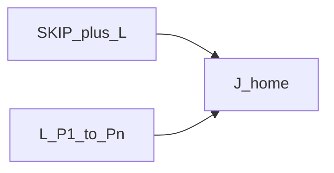

# Skip and contour / plot (union)

> Status: reviewed  
> Brand: FANUC  
> Mode: programmer, learner  
> Track: 01 HandlingTool  
> Practice: `practice/fanuc/016-skip-linear`, `practice/fanuc/019-contour-plot`

## Overview

Two different unions that both use **Linear**:

1. **Skip** — leave a Linear early when a condition is true ([`../programming-tp/logic-skip.md`](../programming-tp/logic-skip.md)).
2. **Contour / plot** — teach a **polyline** of L points (FINE), Joint home. Not the same as Circular (C).

## When to use

- Skip: search, “until sensor,” optional segment
- Plot: a path that is many straight segments (gasket-ish, deburr polyline)
- Circular arcs: [`../programming-tp/motion-types-fine-cnt.md`](../programming-tp/motion-types-fine-cnt.md) and [003](../../../practice/fanuc/003-circular-path/)

## Definition

Skip uses a **placeholder DI**. After skip, the TCP is where the skip fired. A plot listing is just sequential `L P[n]`.

## System

## Worked example

[`016-skip-linear`](../../../practice/fanuc/016-skip-linear/), [`019-contour-plot`](../../../practice/fanuc/019-contour-plot/).

## Practice

- [`016-skip-linear`](../../../practice/fanuc/016-skip-linear/)
- [`019-contour-plot`](../../../practice/fanuc/019-contour-plot/)

## Common mistakes

- Skip as e-stop
- Calling a polyline a Circular program
- CNT on a plot before FINE is proven

## Safety notes

Prove in T1. Site SOP and OEM manuals override this page.

## Official references

On manuals **licensed to your site**: SKIP CONDITION, Linear. Do not paste OEM pages here.

## Repo references

- [`../programming-tp/logic-skip.md`](../programming-tp/logic-skip.md)
- [`../programming-tp/motion-l.md`](../programming-tp/motion-l.md)
- [`../topic-map.md`](../topic-map.md)

## Rights

See [`LEGAL.md`](../../../LEGAL.md): FANUC retains all rights. Educational use; own consent and risk.
