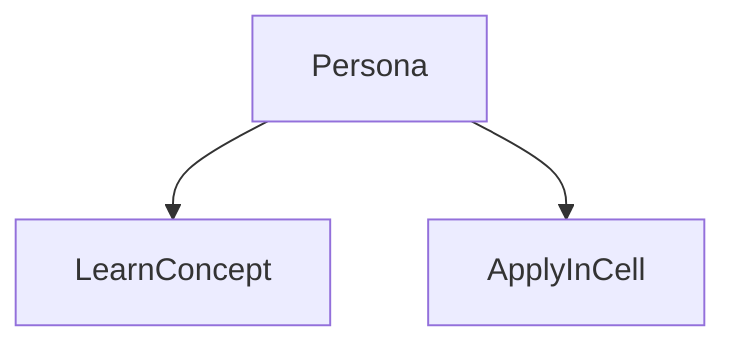
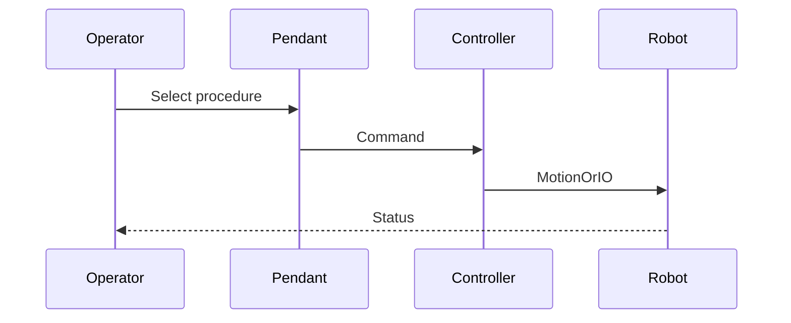

# Collaborative robots (FANUC CRX class)

> Status: stub  
> Brand: FANUC  
> Personas: student, operator, programmer, integrator  
> Related programs: `programs/fanuc/samples/`

## Overview

FANUC collaborative robots (CRX and related) work with reduced force/speed options and different cell design than fenced industrial arms. Still programmed from the teach pendant and controller.

## Definition

A **collaborative robot** is designed for selected collaborative applications under ISO/TS 15066-style limits. Collaboration mode is not a substitute for risk assessment or DCS.

## System

## Use cases

## Sequence

## Safety notes

- OEM manuals and site rules override this stub.
- Collaborative mode, payload, and tooling change stopping performance. Confirm on the actual model.

## Official references

- FANUC handling tool / operator manual: `[OFFICIAL_URL]`
- Software version: `[CONTROLLER_SOFT_VERSION]`

## Repo references

- Index: [`../README.md`](../README.md)
- Template: [`../../_templates/topic.md`](../../_templates/topic.md)
- Sample program: [`../../../programs/fanuc/samples/HOME_SAFE.ls`](../../../programs/fanuc/samples/HOME_SAFE.ls)

## TODO

- Expand from reviewed notes in `inbox/pdf/` and licensed manuals (link, do not paste).
