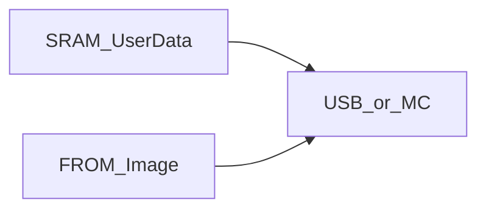

# SRAM, IMAGE, ASCII save

> Status: draft  
> Brand: FANUC  
> Mode: programmer, maintenance

## Overview

Set device (MC or USB) via File → Utility. SRAM backup = user data. IMAGE = FROM. ASCII backup = human-readable programs. Auto backup (SRAM, scheduled) exists on many controllers.

## When to use

- End of shift / before experiments
- Moving one program between robots
- Readable listings for study (this repo’s `.ls` style)

## Definition

Save/load one program from Select. Print one program for a listing. Restore SRAM typically uses **controlled start**, then a cold start to the normal screen — **verify** on your controller.

## System

## Worked example

File → Backup → SRAM to USB; separately File → Backup → ASCII programs for git-friendly listings.

## Practice

Not a motion drill. Keep listings next to [`practice/fanuc/`](../../../practice/fanuc/) solutions.

## Common mistakes

- Restoring IMAGE when you only meant SRAM
- Skipping conflict review on restore

## Safety notes

Wrong restore can drop mastering or I/O config.

### Verify on controller

Confirm image-backup options in the maintenance chapter for your software version.

## Official references

On manuals **licensed to your site**: the operator / HandlingTool chapter for this topic. Do not paste OEM pages here.

## Repo references

- [`overview.md`](overview.md)

## Rights

See [`LEGAL.md`](../../../LEGAL.md): FANUC retains all rights. Educational use; own consent and risk.
