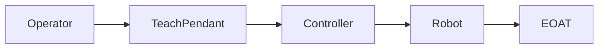
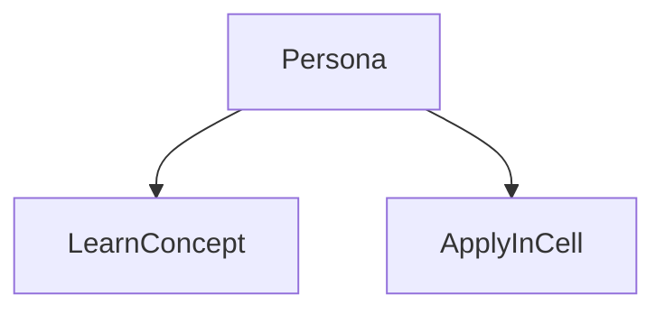
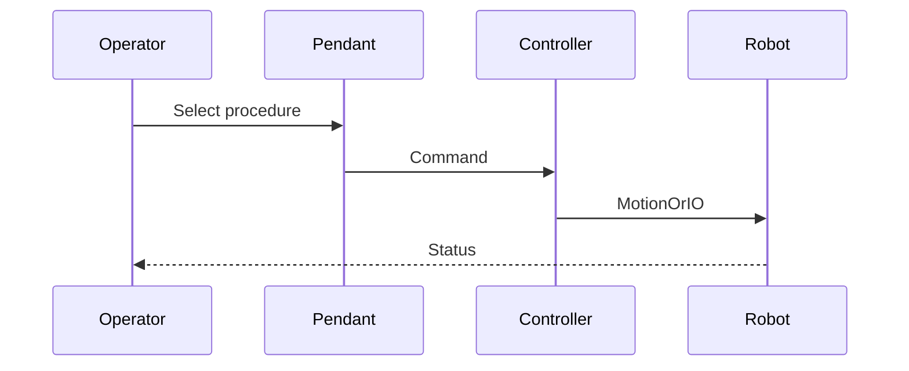

# Controller and teach pendant

> Status: stub  
> Brand: FANUC  
> Personas: student, operator, programmer, integrator  
> Related programs: `programs/fanuc/samples/`

## Overview

The controller (for example R-30iB Plus) runs the motion kernel, I/O, and programs. The teach pendant (iPendant) is the operator/programmer interface for jog, teach, and fault recovery.

## Definition

**Controller**: cabinet that executes TP/Karel. **Teach pendant**: handheld HMI with deadman, mode switch (T1/T2/Auto as applicable), and editors.

## System

## Use cases

## Sequence

## Safety notes

- OEM manuals and site rules override this stub.
- Validate on a teach pendant in a controlled cell.

## Official references

- FANUC handling tool / operator manual: `[OFFICIAL_URL]`
- Software version: `[CONTROLLER_SOFT_VERSION]`

## Repo references

- Index: [`../README.md`](../README.md)
- Template: [`../../_templates/topic.md`](../../_templates/topic.md)
- Sample program: [`../../../programs/fanuc/samples/HOME_SAFE.ls`](../../../programs/fanuc/samples/HOME_SAFE.ls)

## TODO

- Expand from reviewed notes in `inbox/pdf/` and licensed manuals (link, do not paste).
