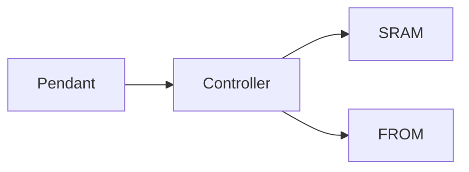

# Controller and pendant

> Status: draft  
> Brand: FANUC  
> Mode: operator, programmer, maintenance

## Overview

The controller executes TP, I/O, and motion. The pendant is the teach/test HMI. SRAM holds user data; FROM/image holds system software.

## When to use

- Explaining backup vs image
- Start modes: hot, cold, controlled (restore/maintenance)

## Definition

**SRAM** — programs, variables, macros, mastering (battery-backed). **FROM / IMAGE** — system software.

## System

## Worked example

Before a software change: SRAM backup, then IMAGE backup. Restore SRAM from controlled start.

## Practice

No dedicated backup drill. See article [`backup-restore.md`](backup-restore.md).

## Common mistakes

- Formatting media that still holds the only backup
- Pulling batteries and jogging production before remastering

## Safety notes

Follow the cabinet sticker. Controller-specific restore key sequences vary by software.

### Verify on controller

Any numeric “system variable” remembered from class must be confirmed in the maintenance manual for *this* CPU version.

## Official references

On manuals **licensed to your site**: the operator / HandlingTool chapter for this topic. Do not paste OEM pages here.

## Repo references

- [`teach-pendant.md`](teach-pendant.md)
- [`backup-restore.md`](backup-restore.md)

## Rights

See [`LEGAL.md`](../../../LEGAL.md): FANUC retains all rights. Educational use; own consent and risk.
