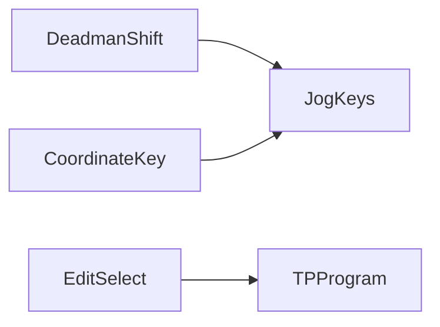

# Teach pendant

> Status: draft  
> Brand: FANUC  
> Mode: operator, programmer, learner

## Overview

Coordinate (Joint vs World; Shift+coordinate for frame type), Fwd / Bwd / Hold / Step, deadman on the back with Shift, Tool1/Tool2, Item+Enter to search, Select / Edit / Data / I/O / Position / Setup / Status / Group.

## When to use

- Jogging, teaching, stepping a program
- Explaining why Group 1 is the six-axis arm

## Definition

**Joint** — J1–J6 in degrees. **World** — X Y Z in mm, W/P/R in degrees.

## System

## Worked example

Hold deadman and Shift, switch Joint, jog J1, switch World, jog X, Shift+TouchUp on a motion line (`@` marks the current line).

## Practice

[`002-square-path`](../../../practice/fanuc/002-square-path/).

## Common mistakes

- Jogging World with the wrong UFRAME
- Releasing deadman and expecting Auto-style Hold behavior

## Safety notes

Keep override low on first touch-up.

## Official references

- HandlingTool / operator manuals: `[OFFICIAL_URL]`

## Repo references

- [`overview.md`](overview.md)
- [`../programming-tp/overview.md`](../programming-tp/overview.md)

## Rights, education, and consent

FANUC retains **all rights** in its trademarks, software, and manuals. See [`LEGAL.md`](../../../LEGAL.md).

This page and any linked programs are **educational and study-aid only**. Use at **your own consent and risk**. Garry TJ / this repo are not FANUC and offer no warranty.
