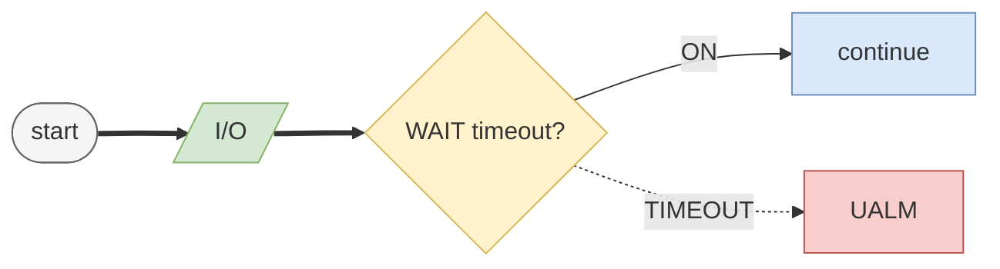
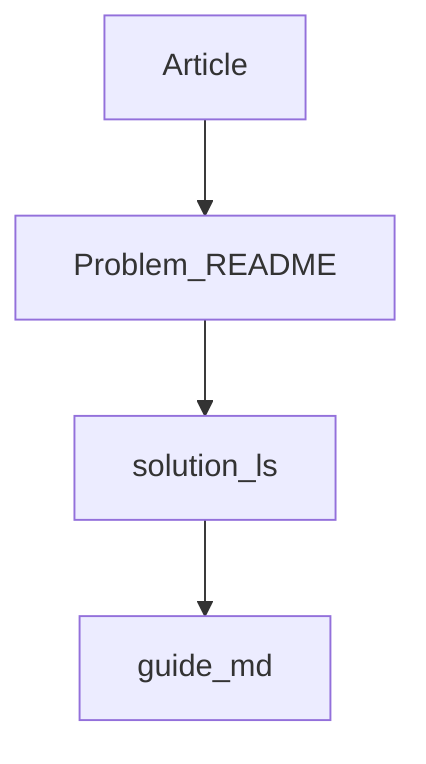

# How to read a program guide

> Status: reviewed  
> Brand: FANUC  
> Mode: learner, programmer  
> Track: 01 HandlingTool  
> Practice: `practice/fanuc/001-home-safe`

## Overview

Each drill is three files. Read them in this order. Do **not** start at pallet (018) or pick/place (017).

1. **Article** (linked from the drill README) — what the instruction is
2. **README.md** — the problem in plain language
3. **`code/solution.ls`** — the study listing (`L0`, `L1`, … under `/MN`)
4. **`doc/guide.md`** — optional **Path / origin** sketch (1-2-3-4 vs 1'-2'-3'-4' for OFFSET), then one L# flowchart, the `/MN` listing, then a block table

Start here: [`T1 / T2 / Auto`](safety-dcs/modes-t1-t2-auto.md), then [`001-home-safe`](../../practice/fanuc/001-home-safe/). Words: [`../glossary.md`](../glossary.md).

## When to use

- First time you open a `doc/guide.md`
- Before `/fanuc-explain` on a listing
- Not as a substitute for the pendant or OEM manuals

## Definition

**`L6`** on a chart node is line **6** in `/MN` of that drill’s `code/solution.ls`.

| Shape | Means |
|-------|--------|
| Stadium (rounded pill) | Start or **END** |
| Rectangle | Motion or assignment (Joint **J**, Linear **L**, registers) |
| Diamond (rhombus) | Decision: **IF**, **WAIT** timeout, **SKIP** |
| Parallelogram | Digital I/O (**RO** / **RI** / **DI** / **DO**) |
| Subroutine box | **CALL** another program |
| Dashed / dotted box or arrow | Remark, skipped lines, optional, or fault/timeout |

| Color (muted) | Means |
|---------------|--------|
| Gray stadium | Start / end |
| Blue | Process |
| Yellow | Decision |
| Green | I/O |
| Purple | CALL |
| Red | **UALM** / **ABORT** |
| White dashed | Remark / not executed |

Thick arrow `==>` = happy path. Dotted `-.->` = remark, skip, or timeout.

**Atom** in the block table is the instruction family. Look it up in the [glossary](../glossary.md) or the article on the drill README.

## System

## Worked example

Open [`001-home-safe`](../../practice/fanuc/001-home-safe/): statement → `doc/guide.md` listing line `6:` → chart node `L6`.

## Practice

[`001-home-safe`](../../practice/fanuc/001-home-safe/), then [`002-square-path`](../../practice/fanuc/002-square-path/). Handshake with a diamond: [`007-wait-gripper`](../../practice/fanuc/007-wait-gripper/).

## Common mistakes

- Treating the author template as the homework ([`_templates/program-guide.md`](../_templates/program-guide.md) is for writers)
- Copying placeholder I/O or millimetres onto a cell
- Skipping T1 prove-out

## Safety notes

Study material only. Site SOP and OEM manuals override this page.

## Official references

On manuals **licensed to your site**: HandlingTool instruction list. Do not paste OEM pages here.

## Repo references

- [`learning-path.md`](learning-path.md)
- [`programming-tp/keywords.md`](programming-tp/keywords.md)
- Cursor authors: [`.cursor/rules/documentation/mermaid-program-flow.mdc`](../../.cursor/rules/documentation/mermaid-program-flow.mdc)

## Rights

See [`LEGAL.md`](../../LEGAL.md): FANUC retains all rights. Educational use; own consent and risk.
