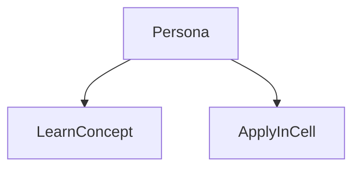
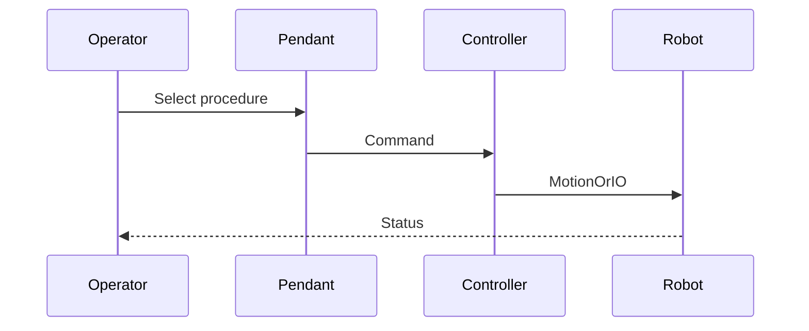

# Industrial arm (FANUC)

> Status: stub  
> Brand: FANUC  
> Personas: student, operator, programmer, integrator  
> Related programs: `programs/fanuc/samples/`

## Overview

Six-axis industrial manipulators (for example LR Mate, M-series) used behind fencing or area scanners. Higher payload and speed than cobots; programming is still TP/Karel on the same controller family.

## Definition

An **industrial robot arm** is a programmed manipulator for handling or process work. It is **not** inherently power-and-force limited the way a collaborative robot is; safeguarding is external (fence, DCS, muting, etc.).

## System

## Use cases

## Sequence

## Safety notes

- OEM manuals and site rules override this stub.
- Never treat industrial-arm examples as cobot-safe speeds.

## Official references

- FANUC handling tool / operator manual: `[OFFICIAL_URL]`
- Software version: `[CONTROLLER_SOFT_VERSION]`

## Repo references

- Index: [`../README.md`](../README.md)
- Template: [`../../_templates/topic.md`](../../_templates/topic.md)
- Sample program: [`../../../programs/fanuc/samples/HOME_SAFE.ls`](../../../programs/fanuc/samples/HOME_SAFE.ls)

## TODO

- Expand from reviewed notes in `inbox/pdf/` and licensed manuals (link, do not paste).
