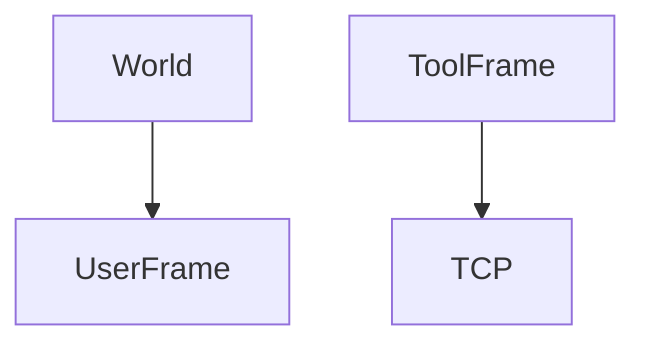

# User, tool, and jog frames

> Status: draft  
> Brand: FANUC  
> Mode: programmer, integrator, learner

## Overview

**User frame** is a work origin (3-point method common). **Tool frame** moves origin from flange to TCP. **Jog frame** is a temporary jog alignment. Programs set `UFRAME_NUM`.

## When to use

- Fixtures that are not World-aligned
- Dual grippers (two tool frames)
- OFFSET CONDITION with a position register

## Definition

3-point UFRAME: origin, X direction, Y direction (Shift+Record). OFFSET does not apply to INC motions in the class pattern.

## System

## Worked example

Menu → Setup → Frames → 3-point; then `UFRAME_NUM=2` at the top of a path. Shift+Coordinate to jog in that frame.

## Practice

- [`005-offset-path`](../../../practice/fanuc/005-offset-path/)
- [`008-pr-lpos`](../../../practice/fanuc/008-pr-lpos/)
- [`004-incremental-box`](../../../practice/fanuc/004-incremental-box/)

## Common mistakes

- Teaching after a tool change without retouching UTOOL
- Mixing INC and OFFSET on the same geometry

## Safety notes

Wrong UTOOL/UFRAME puts every point in the fixture.

## Official references

- HandlingTool / operator manuals: `[OFFICIAL_URL]`

## Repo references

- [`io-classes.md`](io-classes.md)

## Rights, education, and consent

FANUC retains **all rights** in its trademarks, software, and manuals. See [`LEGAL.md`](../../../LEGAL.md).

This page and any linked programs are **educational and study-aid only**. Use at **your own consent and risk**. Garry TJ / this repo are not FANUC and offer no warranty.
