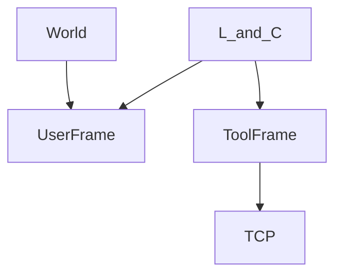

# User, tool, and jog frames

> Status: reviewed  
> Brand: FANUC  
> Mode: programmer, integrator, learner  
> Track: 01 HandlingTool  
> Practice: `practice/fanuc/004-incremental-box`, `practice/fanuc/005-offset-path`, `practice/fanuc/008-pr-lpos`  
> Pendant: curriculum pass only — confirm menus on your software; not a cell verification

## Overview

A **frame** is an origin + orientation the controller uses for Cartesian motion and jog. Wrong frame = every `L` / `C` point is in the wrong place, even if Joint looks fine.

## When to use

- Fixture not aligned with World → **user frame**
- TCP not at the flange (gripper, gun) → **tool frame**
- Jogging along a fixture during teach → **jog frame** (teach aid; programs still set `UFRAME_NUM` / `UTOOL_NUM`)
- Repeating a path in a grid → OFFSET / PR math ([`008`](../../../practice/fanuc/008-pr-lpos/), [`005`](../../../practice/fanuc/005-offset-path/))

## Definition

**UFRAME (user):** work origin. **UTOOL (tool):** TCP relative to the face plate. Programs should set both **before** the first Cartesian move:

```text
UFRAME_NUM=2
UTOOL_NUM=1
```

**3-point user frame (study sequence):**

1. Setup → Frames → User. Pick an unused frame number.
2. Method: three point (wording varies).
3. **Origin** — touch a corner of the fixture (Shift+Record).
4. **X direction** — a point along +X on the fixture.
5. **XY plane / Y** — a point that defines +Y (right-hand rule with Z).
6. Apply / done, then Shift+Coordinate and jog **User** to verify +X/+Y match the fixture.

Direct numeric entry is for known CAD offsets, not a substitute for a recorded fixture.

**Tool frame:** three-point and six-point methods exist; payload and TCP must match the EOAT. After a gripper change, retouch UTOOL before touching path points.

**OFFSET vs INC:** OFFSET shifts a taught path in a frame. INC treats the recorded pose as a delta. Do not stack both on the same geometry until you can draw it.

## System



## Worked example

Teach UFRAME 2 on the nest. At the top of the square path set `UFRAME_NUM=2`. Jog User +X: the TCP should travel along the fixture, not World. Then run [`002-square-path`](../../../practice/fanuc/002-square-path/) in T1. INC box: [`004-incremental-box`](../../../practice/fanuc/004-incremental-box/).

## Practice

- [`004-incremental-box`](../../../practice/fanuc/004-incremental-box/)
- [`005-offset-path`](../../../practice/fanuc/005-offset-path/)
- [`008-pr-lpos`](../../../practice/fanuc/008-pr-lpos/)

## Common mistakes

- Teaching Cartesian points, then changing UTOOL without retouch
- Jogging World while the program runs in UFRAME 2
- Mixing INC and OFFSET on the same square
- Six-point tool taught with the wrong pointer / bent TCP

## Safety notes

A wrong UTOOL at Auto speed is a crash. Prove frames in T1 with a slow Linear along +X.

## Official references

On manuals **licensed to your site**: Frames setup (user / tool / jog), Coordinate key, OFFSET CONDITION, INC.

## Repo references

- [`io-classes.md`](io-classes.md)
- [`../programming-tp/offset-and-incremental.md`](../programming-tp/offset-and-incremental.md)
- [`../motion-paths-home/jog-and-recovery.md`](../motion-paths-home/jog-and-recovery.md)

## Rights

See [`LEGAL.md`](../../../LEGAL.md): FANUC retains all rights. Educational use; own consent and risk.
