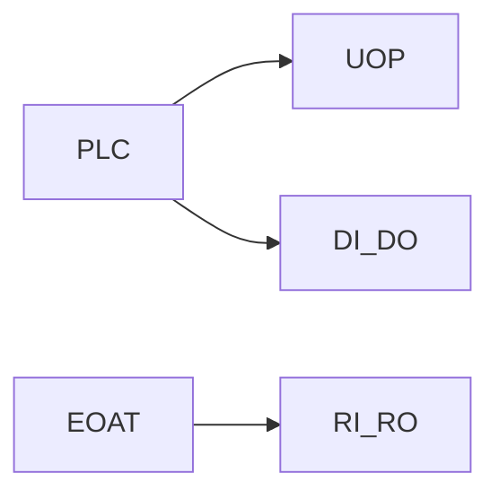

# I/O classes, PNS and RSR

> Status: draft  
> Brand: FANUC  
> Mode: programmer, integrator

## Overview

General-purpose DI/DO, GI/GO, AI/AO vs specialized RI/RO (arm/EOAT), UOP (remote), SOP (standard panel). **PNS** and **RSR** select programs from a PLC.

## When to use

- Gripper handshake on RI/RO
- Remote start after teaching
- Group I/O as binary packed discretes

## Definition

Pulse DO has a documented maximum duration on the controller (class: 327.67 s). Enable PNS under Setup → Program Select; Remote vs Local in System Config.

## System

## Worked example

`RO[1]=ON` then `WAIT RI[1]=ON TIMEOUT` with UALM/ABORT on failure — [`007-wait-gripper`](../../../practice/fanuc/007-wait-gripper/).

## Practice

[`007-wait-gripper`](../../../practice/fanuc/007-wait-gripper/).

## Common mistakes

- Using class I/O numbers on a different rack
- Remote/Local left wrong so PLC or pendant is ignored

## Safety notes

Placeholder I/O only. Map on the cell.

## Official references

- HandlingTool / operator manuals: `[OFFICIAL_URL]`

## Repo references

- [`frames.md`](frames.md)

## Rights, education, and consent

FANUC retains **all rights** in its trademarks, software, and manuals. See [`LEGAL.md`](../../../LEGAL.md).

This page and any linked programs are **educational and study-aid only**. Use at **your own consent and risk**. Garry TJ / this repo are not FANUC and offer no warranty.
