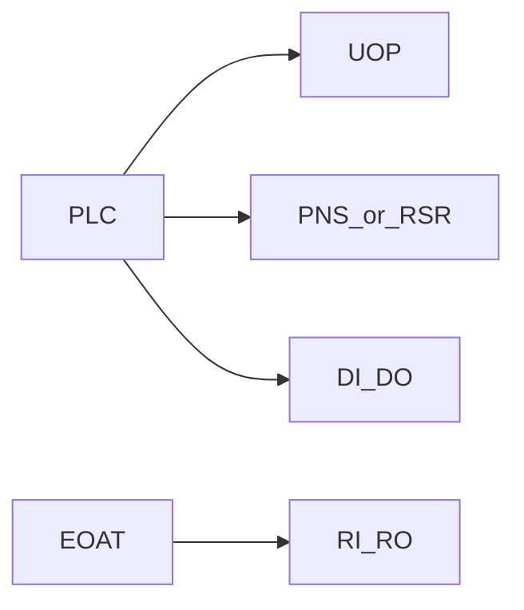

# I/O classes, PNS and RSR

> Status: reviewed  
> Brand: FANUC  
> Mode: programmer, integrator  
> Track: 01 HandlingTool  
> Practice: `practice/fanuc/007-wait-gripper`, `practice/fanuc/010-main-call`

## Overview

I/O classes at a glance. **Atoms:** SOP/UOP and SI/SO have their own pages. **Union drill:** gripper handshake [`007`](../../../practice/fanuc/007-wait-gripper/).

I/O is how the controller talks to the cell: gripper, PLC, operator panel, remote program select. **Numbers in this repo are placeholders.** Rack, slot, and start bits are taught on the real hardware.

## When to use

- EOAT handshake on **RI/RO** (robot-side) vs plant **DI/DO**
- Packed **GI/GO** for a byte from a PLC
- **UOP** when a PLC starts/stops remotely
- **PNS / RSR** when the PLC **selects which program** to run (not the same as DI)

## Definition

| Class | Study meaning |
|-------|----------------|
| DI/DO | General digital, often PLC |
| RI/RO | Typically EOAT / arm tooling |
| GI/GO | Grouped bits as an integer |
| AI/AO | Analog |
| SOP | Standard operator panel — [io-sop-uop.md](io-sop-uop.md) |
| UOP | Peripheral / remote — [io-sop-uop.md](io-sop-uop.md) |
| SI/SO | Safety-rated I/O — [io-safety-si-so.md](io-safety-si-so.md); **not** gripper bits |
| PNS | Program number select (binary program index from PLC) |
| RSR | Robot service request style select (site-dependent setup) |

Remote vs Local (System Config) decides whether the pendant or the PLC is in charge of start. Wrong setting looks like “the program will not start.”

Pulse length and wait timeouts are controller settings — confirm on the teach pendant, do not copy a number from memory.

## System

## Worked example

Handshake: `RO[n]=ON` then `WAIT RI[n]=ON TIMEOUT,LBL` then `UALM` / recover — [`007-wait-gripper`](../../../practice/fanuc/007-wait-gripper/).

A simple Auto sequence is often a **main** that only `CALL`s home and process programs so PNS can point at one name — [`010-main-call`](../../../practice/fanuc/010-main-call/).

Menu hints (labels vary by pendant): I/O → Interconnect; Setup → Prog Select for PNS/RSR; System → Config for Remote/Local.

## Practice

- [`007-wait-gripper`](../../../practice/fanuc/007-wait-gripper/)
- [`010-main-call`](../../../practice/fanuc/010-main-call/)

## Common mistakes

- Teaching RI/RO indexes from another robot
- PNS enabled but PLC bits not matching the program list
- Remote/Local left on the wrong source
- Using DO for a gripper that is wired on RO

## Safety notes

Placeholder I/O only. Safety-rated I/O and DCS are separate from “gripper DO.”

## Official references

On manuals **licensed to your site**: I/O setup, Interconnect, UOP, Program Select (PNS/RSR), System Config Remote/Local.

## Repo references

- [`io-sop-uop.md`](io-sop-uop.md)
- [`io-safety-si-so.md`](io-safety-si-so.md)
- [`pr-vs-r.md`](pr-vs-r.md)
- [`frames.md`](frames.md)
- [`../alarms/overview.md`](../alarms/overview.md)

## Rights, education, and consent

FANUC retains **all rights** in its trademarks, software, and manuals. See [`LEGAL.md`](../../../LEGAL.md).

This page and any linked programs are **educational and study-aid only**. Use at **your own consent and risk**. Garry TJ / this repo are not FANUC and offer no warranty.
