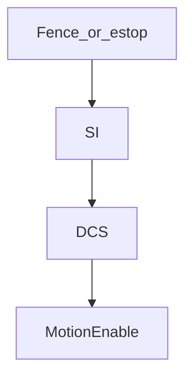

# SI and SO (safety I/O)

> Status: reviewed  
> Brand: FANUC  
> Mode: integrator, programmer  
> Track: 01 HandlingTool

## Overview

**SI / SO** here means **safety-rated inputs and outputs** (fence, e-stop chains, DCS-related points — **your cabinet labels win**). They are **not** gripper DI/DO and **not** SKIP CONDITION bits. This page does not list real SI/SO numbers.

## When to use

- Knowing why a fence open faults Auto
- Talking to the safety PLC / DCS setup
- Not for: bypass, jumper, or “skip the fence in TP”

## Definition

Look up **your** software: Safety I/O, DCS, fence. Do not copy indexes from study notes. Collaborative cells still have configured limits.

## System

## Worked example

No TP drill that writes SO to mute a fence. Recovery after a **understood** stop: [`009-fault-home`](../../../practice/fanuc/009-fault-home/). Modes: [`../safety-dcs/modes-t1-t2-auto.md`](../safety-dcs/modes-t1-t2-auto.md).

## Practice

None that drive SI/SO. Do not add placeholder SO=ON in a drill.

## Common mistakes

- Using SKIP or DO as if it were a safety output
- Reset loops on a still-open fence

## Safety notes

This guide does not authorize bypasses. Site SOP and OEM manuals override this page.

## Official references

On manuals **licensed to your site**: Dual Check Safety, safety I/O, fence. Do not paste OEM pages here.

## Repo references

- [`../safety-dcs/overview.md`](../safety-dcs/overview.md)
- [`io-classes.md`](io-classes.md)
- [`../alarms/overview.md`](../alarms/overview.md)

## Rights

See [`LEGAL.md`](../../../LEGAL.md): FANUC retains all rights. Educational use; own consent and risk.
