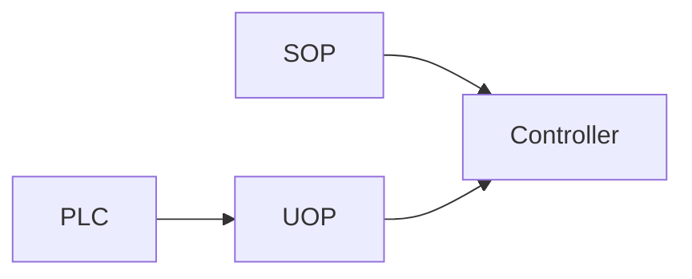

# SOP and UOP

> Status: reviewed  
> Brand: FANUC  
> Mode: integrator, programmer, operator  
> Track: 01 HandlingTool

## Overview

**SOP** — standard operator panel (buttons and lamps the controller already names). **UOP** — user / peripheral bits used with a PLC (cycle, hold, safety speed, IMSTP, and related — **names and numbers are cell-specific**). This page does **not** publish a plant map.

## When to use

- Explaining why Auto starts from the panel, not a casual pendant Cycle
- Remote vs Local (System Config)
- Not for: copying SOP/UOP indexes from this repo onto a live interconnect

## Definition

Placeholders only. Look up Interconnect and UOP assignment on **your** controller. PNS/RSR is program **select**, not the same as a single DI start — [io-classes.md](io-classes.md).

## System

## Worked example

No TP drill (no fake bits). Practice remote-select conceptually with [`010-main-call`](../../../practice/fanuc/010-main-call/) as the program a PLC might PNS, after Local/Remote is set correctly.

## Practice

Procedure: confirm Remote/Local and UOP on the cell with the site electrician. TP: [`010-main-call`](../../../practice/fanuc/010-main-call/).

## Common mistakes

- Inventing IMSTP bit numbers from a notebook
- Pendant start while the cell is Remote-only

## Safety notes

UOP includes signals that can start motion. Site SOP, lockout, and OEM manuals override this page.

## Official references

On manuals **licensed to your site**: SOP, UOP, Interconnect, System Config. Do not paste OEM pages here.

## Repo references

- [`io-classes.md`](io-classes.md)
- [`../safety-dcs/modes-t1-t2-auto.md`](../safety-dcs/modes-t1-t2-auto.md)

## Rights

See [`LEGAL.md`](../../../LEGAL.md): FANUC retains all rights. Educational use; own consent and risk.
