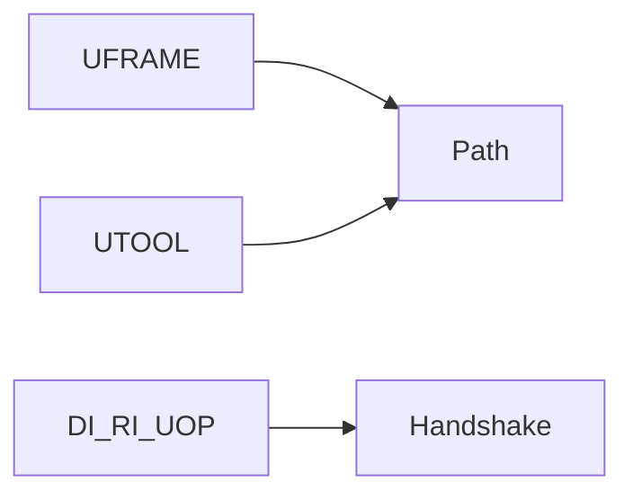

# I/O, frames, and tools

> Status: draft  
> Brand: FANUC  
> Mode: programmer, integrator, learner

## Overview

Frames locate the work and TCP. I/O talks to PLC and EOAT. Payload includes gripper, fixture, and part.

## When to use

- Any path that is not World-origin
- Any gripper or fixture handshake

## Definition

EOAT may sit on RI/RO or general DI/DO depending on the trainer.

## System

## Worked example

Set UFRAME and UTOOL, then a square drill, then a wait-on-gripper sub.

## Practice

[`002-square-path`](../../../practice/fanuc/002-square-path/), [`007-wait-gripper`](../../../practice/fanuc/007-wait-gripper/).

## Common mistakes

- Welding analog examples copied onto a handling gripper

## Safety notes

Confirm rack comments on the real I/O screen.

## Official references

On manuals **licensed to your site**: the operator / HandlingTool chapter for this topic. Do not paste OEM pages here.

## Repo references

- [`frames.md`](frames.md)
- [`io-classes.md`](io-classes.md)

## Rights, education, and consent

FANUC retains **all rights** in its trademarks, software, and manuals. See [`LEGAL.md`](../../../LEGAL.md).

This page and any linked programs are **educational and study-aid only**. Use at **your own consent and risk**. Garry TJ / this repo are not FANUC and offer no warranty.
