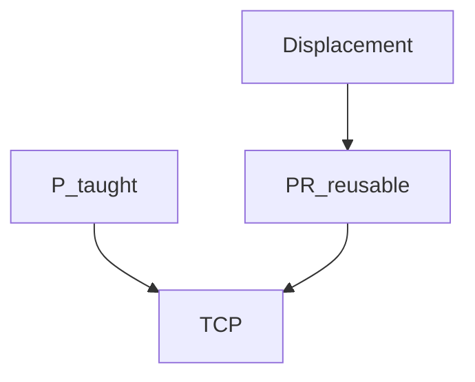

# P[], PR[], R[] — placement vs displacement

> Status: reviewed  
> Brand: FANUC  
> Mode: programmer, learner  
> Track: 01 HandlingTool  
> Practice: `practice/fanuc/004-incremental-box`, `practice/fanuc/005-offset-path`, `practice/fanuc/008-pr-lpos`

## Overview

**Placement** is “the TCP should be **here**” (a taught **P[]** or **PR[]**). **Displacement** is “shift that pose by a delta” (**INC**, **OFFSET CONDITION**, or **PR** element math / LPOS).

## When to use

| Need | Use |
|------|-----|
| A pose in this program | `P[]` |
| A reusable pose (home, nest origin) | `PR[]` |
| A counter | `R[]` |
| Known pitch on Linear | INC — [004](../../../practice/fanuc/004-incremental-box/) |
| Same path, next nest | OFFSET — [005](../../../practice/fanuc/005-offset-path/) |
| Copy current Cartesian into PR, then add mm | LPOS / PR elements — [008](../../../practice/fanuc/008-pr-lpos/) |

## Definition

Do not mix INC and OFFSET on the same geometry until you can draw it. `UFRAME_NUM` / `UTOOL_NUM` apply to Cartesian placement.

## System

## Worked example

Home as placement: [`001`](../../../practice/fanuc/001-home-safe/). Grid of placements: [`018-pallet-grid`](../../../practice/fanuc/018-pallet-grid/).

## Practice

- [`004-incremental-box`](../../../practice/fanuc/004-incremental-box/)
- [`005-offset-path`](../../../practice/fanuc/005-offset-path/)
- [`008-pr-lpos`](../../../practice/fanuc/008-pr-lpos/)
- [`018-pallet-grid`](../../../practice/fanuc/018-pallet-grid/)

## Common mistakes

- Storing XYZ in R[]
- OFFSET on INC lines
- Changing UTOOL after teaching P[] without retouch

## Safety notes

Wrong frame + displacement = crash. Prove in T1. Site SOP and OEM manuals override this page.

## Official references

On manuals **licensed to your site**: position registers, OFFSET, INC, LPOS. Do not paste OEM pages here.

## Repo references

- [`frames.md`](frames.md)
- [`../programming-tp/offset-and-incremental.md`](../programming-tp/offset-and-incremental.md)
- [`../programming-tp/registers-numeric.md`](../programming-tp/registers-numeric.md)

## Rights

See [`LEGAL.md`](../../../LEGAL.md): FANUC retains all rights. Educational use; own consent and risk.
