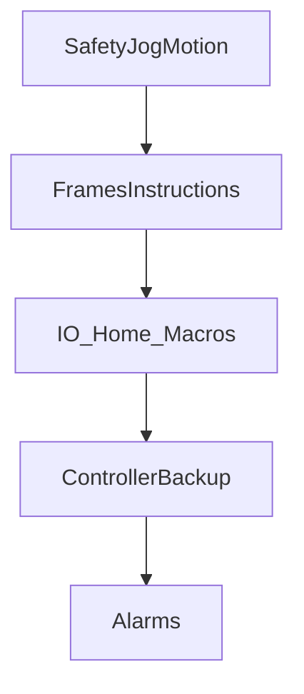

# HandlingTool learning path

> Status: reviewed  
> Brand: FANUC  
> Mode: learner, programmer, operator, integrator  
> Track: 01 HandlingTool

## Overview

Suggested **study order** for this educational track (not an official FANUC outline): safety and jog, frames and instructions, I/O and home, controller backup, then alarms.

## When to use

- Planning what to read in `docs/fanuc/`
- Pairing articles with `practice/fanuc/` drills
- Looking up a word: [`glossary.md`](../glossary.md), shop talk: [`jargons.md`](../jargons.md)
- Atom vs combined programs: [`topic-map.md`](topic-map.md)

## Definition

Teach Pendant (HandlingTool) is the language for this track. Karel and DCS are optional later topics.

## System

| Step | Read | Drill |
|------|------|-------|
| 1 | [T1/T2/Auto](safety-dcs/modes-t1-t2-auto.md), [pendant](controller-pendant/teach-pendant.md), [jog/recovery](motion-paths-home/jog-and-recovery.md), [motion](motion-paths-home/overview.md) | [001](../../practice/fanuc/001-home-safe/), [002](../../practice/fanuc/002-square-path/) |
| 2 | [Frames](io-frames-tools/frames.md), [identifiers](programming-tp/identifiers.md), [keywords](programming-tp/keywords.md), [J/L/C](programming-tp/motion-types-fine-cnt.md), [offset/INC](programming-tp/offset-and-incremental.md) | [003](../../practice/fanuc/003-circular-path/), [004](../../practice/fanuc/004-incremental-box/), [005](../../practice/fanuc/005-offset-path/), [008](../../practice/fanuc/008-pr-lpos/) |
| 3 | [I/O](io-frames-tools/io-classes.md), [CALL](programming-tp/registers-jumps-call.md) | [006](../../practice/fanuc/006-loop-call/), [007](../../practice/fanuc/007-wait-gripper/), [010](../../practice/fanuc/010-main-call/) |
| 4 | [Backup](controller-pendant/backup-restore.md) | Procedure (no TP drill) |
| 5 | [Alarms](alarms/overview.md), [UALM](programming-tp/ualm.md) | [007](../../practice/fanuc/007-wait-gripper/), [009](../../practice/fanuc/009-fault-home/), [020](../../practice/fanuc/020-user-alarm/) |
| 6 | Atoms then unions: [topic map](topic-map.md) | [011](../../practice/fanuc/011-joint-only/)–[021](../../practice/fanuc/021-message/) |

## Worked example

Teach in T1, step-test in T2, production in Auto. Start with [`001-home-safe`](../../practice/fanuc/001-home-safe/) and [`002-square-path`](../../practice/fanuc/002-square-path/).

## Practice

Full list: [`practice/fanuc/`](../../practice/fanuc/).

## Common mistakes

- Treating study notes as the operator manual
- Skipping T1 prove-out and jumping to Auto

## Safety notes

Site SOP and OEM manuals override this guide.

## Official references

On manuals **licensed to your site**: operator / HandlingTool set for your software version. Do not paste those books into the repo.

## Repo references

- [`README.md`](README.md)

## Rights, education, and consent

FANUC retains **all rights** in its trademarks, software, and manuals. See [`LEGAL.md`](../../LEGAL.md).

This page and any linked programs are **educational and study-aid only**. Use at **your own consent and risk**. Garry TJ / this repo are not FANUC and offer no warranty.
