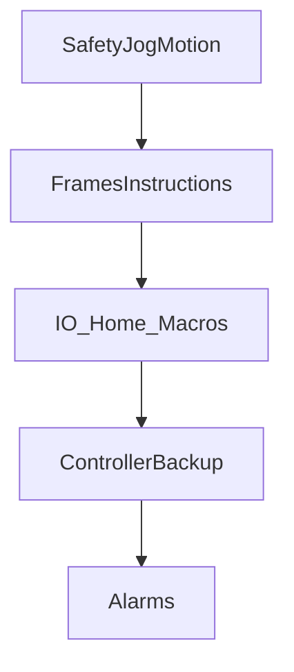

# HandlingTool learning path

> Status: draft  
> Brand: FANUC  
> Mode: learner, programmer, operator, integrator  
> Track: 01 HandlingTool

## Overview

A suggested order for this **educational** track: safety and jog, frames and instructions, I/O and home, controller backup, then alarms. Use it to study HandlingTool on industrial arms and cobots. It is not an official FANUC course outline.

## When to use

- Planning what to read in `docs/fanuc/`
- Pairing articles with `practice/fanuc/` drills

## Definition

Teach Pendant (HandlingTool) is the language for this track. Karel and DCS are optional later topics.

## System

## Worked example

Teach in T1, step-test in T2, production in Auto. Then practice [`001-home-safe`](../../practice/fanuc/001-home-safe/) and [`002-square-path`](../../practice/fanuc/002-square-path/).

## Practice

Start at [`practice/fanuc/`](../../practice/fanuc/).

## Common mistakes

- Treating study notes as the operator manual
- Skipping T1 prove-out and jumping to Auto

## Safety notes

Site SOP and OEM manuals override this guide.

## Official references

- HandlingTool / operator manuals: `[OFFICIAL_URL]`

## Repo references

- [`README.md`](README.md)

## Rights, education, and consent

FANUC retains **all rights** in its trademarks, software, and manuals. See [`LEGAL.md`](../../LEGAL.md).

This page and any linked programs are **educational and study-aid only**. Use at **your own consent and risk**. Garry TJ / this repo are not FANUC and offer no warranty.
