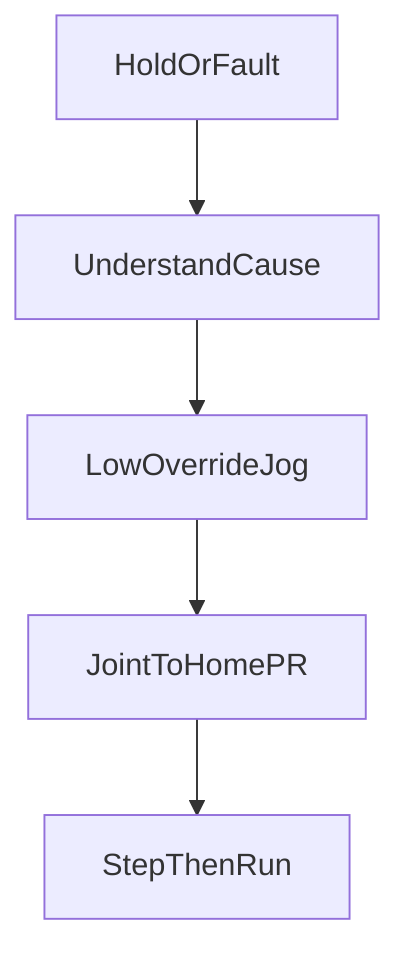

# Jog, Hold, and recovery

> Status: reviewed  
> Brand: FANUC  
> Mode: operator, programmer, learner  
> Track: 01 HandlingTool  
> Practice: `practice/fanuc/001-home-safe`, `practice/fanuc/009-fault-home`

## Overview

Jog is how you move the arm **without** running a program: coordinate system + jog keys + deadman + Shift + override. Recovery is how you get back to a known pose after Hold, a fault, or a bad teach — usually **Joint to a taught home**, not a guessed World move through the fixture.

## When to use

- Teaching points (Touch-Up) in T1
- Clearing a workspace after Hold
- After a fault you **understand**, returning to home at low override
- Not for: defeating a fence, jogging with unknown UFRAME/UTOOL, or “reset and cycle start” blindly

## Definition

**Hold** — pauses motion; in teach modes releasing deadman or Shift also stops. **Fault** — the controller will not run until the condition is cleared and Reset is used per site SOP. **Home** — a taught `PR[]` (or a dedicated home program), not mechanical zero.

**Joint jog** — each axis. **World / user / tool jog** — Cartesian; wrong frame = wrong direction.

## System

## Worked example

1. Stop: Hold (or deadman release in T1/T2).
2. Look: alarm line, last motion, gripper state. Do not Reset until the cause is known.
3. Coordinate: Joint. Override low (start around 10%).
4. Jog axes that are clearly in free space; do not World-jog if UFRAME is unknown.
5. Select a home program or run Joint to `PR[1:Home]` FINE — [`001-home-safe`](../../../practice/fanuc/001-home-safe/), [`009-fault-home`](../../../practice/fanuc/009-fault-home/).
6. Step the next production move in T1 before Auto.

Touch-Up: cursor on the motion line, Shift+Touch-Up records the current pose into that `P[]` / `PR[]`.

## Practice

- [`001-home-safe`](../../../practice/fanuc/001-home-safe/)
- [`009-fault-home`](../../../practice/fanuc/009-fault-home/)
- Pendant keys: [`../controller-pendant/teach-pendant.md`](../controller-pendant/teach-pendant.md)

## Common mistakes

- World jog after someone else changed Coordinate / UFRAME
- Linear “shortcut” home through a clamp because Joint looked slower
- Reset + Cycle Start on a fault whose cause is still present
- High override while jogging near a fixture

## Safety notes

Site SOP and OEM manuals override this page. Collaborative vs industrial cells differ; DCS/safety I/O is not optional.

## Official references

On the manuals **licensed to your site** (do not paste them here): operator / HandlingTool chapters on jog, coordinate systems, Hold, and recovery. Alarm text: see [`../alarms/overview.md`](../alarms/overview.md).

## Repo references

- [`overview.md`](overview.md)
- [`../safety-dcs/modes-t1-t2-auto.md`](../safety-dcs/modes-t1-t2-auto.md)

## Rights, education, and consent

FANUC retains **all rights** in its trademarks, software, and manuals. See [`LEGAL.md`](../../../LEGAL.md).

This page and any linked programs are **educational and study-aid only**. Use at **your own consent and risk**. Garry TJ / this repo are not FANUC and offer no warranty.
