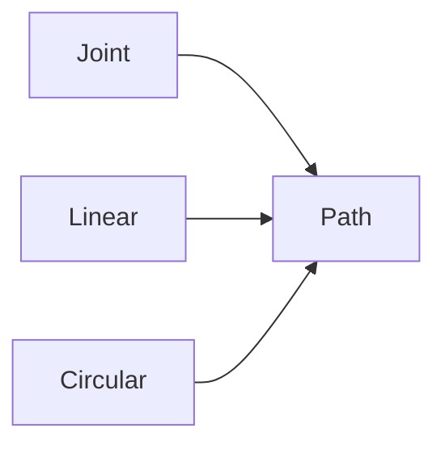

# Motion, paths, and home

> Status: draft  
> Brand: FANUC  
> Mode: programmer, operator, learner

## Overview

Motion types **J / L / C / A**. Termination **FINE** vs **CNT n**. Home should be a taught reference (PR), not assumed mechanical zero.

## When to use

- Designing approach, process, and retreat
- Recovery to a known pose

## Definition

Joint feed is percent; linear is typically mm/s. Mastering (zero / single-axis) is maintenance — use the OEM chapter, not this article, to remaster.

## System

## Worked example

Joint fly-over to P[1], Linear process, Joint back to home PR — [`001`](../../../practice/fanuc/001-home-safe/) and [`002`](../../../practice/fanuc/002-square-path/).

## Practice

[`001-home-safe`](../../../practice/fanuc/001-home-safe/), [`002-square-path`](../../../practice/fanuc/002-square-path/), [`003-circular-path`](../../../practice/fanuc/003-circular-path/).

## Common mistakes

- Linear through a fixture because Joint was not used for the fly-over
- CNT 100 at full override beside a clamp

## Safety notes

Do not jog production after battery work until mastering is confirmed.

## Official references

- HandlingTool / operator manuals: `[OFFICIAL_URL]`

## Repo references

- [`../programming-tp/motion-types-fine-cnt.md`](../programming-tp/motion-types-fine-cnt.md)

## Rights, education, and consent

FANUC retains **all rights** in its trademarks, software, and manuals. See [`LEGAL.md`](../../../LEGAL.md).

This page and any linked programs are **educational and study-aid only**. Use at **your own consent and risk**. Garry TJ / this repo are not FANUC and offer no warranty.
