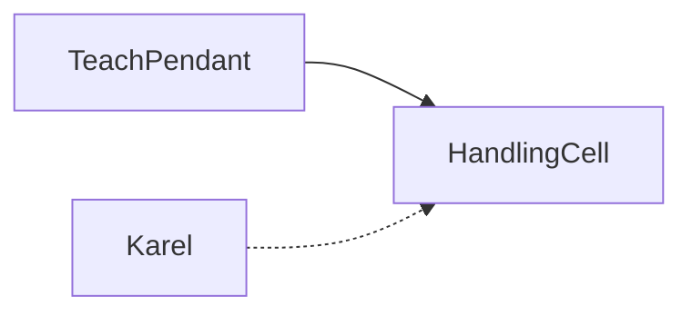

# Karel

> Status: stub  
> Brand: FANUC  
> Mode: programmer, learner

## Overview

Track 01 does not cover Karel. HandlingTool TP is the language for this curriculum.

## When to use

- After a Karel course or controller option is confirmed
- Not as a default for Track 01 drills

## Definition

Karel is FANUC’s compiled language (`.kl`). Names and reserved words there are **not** the HandlingTool lists in [`../programming-tp/identifiers.md`](../programming-tp/identifiers.md) and [`../programming-tp/keywords.md`](../programming-tp/keywords.md).

## System

## Worked example

Use [`practice/fanuc/`](../../../practice/fanuc/) TP solutions until a Karel track exists.

## Practice

None in Track 01.

## Common mistakes

- Generating Karel as if it were required for Track 01 drills

## Safety notes

Karel plus TP CALL needs options you must verify on the controller.

## Official references

On manuals **licensed to your site**: the operator / HandlingTool chapter for this topic. Do not paste OEM pages here.

## Repo references

- [`../programming-tp/overview.md`](../programming-tp/overview.md)

## Rights, education, and consent

FANUC retains **all rights** in its trademarks, software, and manuals. See [`LEGAL.md`](../../../LEGAL.md).

This page and any linked programs are **educational and study-aid only**. Use at **your own consent and risk**. Garry TJ / this repo are not FANUC and offer no warranty.
