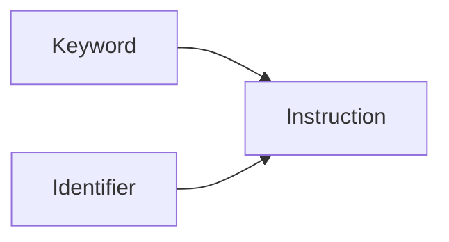

# Keywords (reserved instruction words)

> Status: reviewed  
> Brand: FANUC  
> Mode: programmer, learner  
> Track: 01 HandlingTool  
> Practice: `practice/fanuc/` (all drills)

## Overview

A **keyword** is a reserved HandlingTool word or modifier. The pendant inserts it from menus; you do not invent spelling. **Identifiers** (program names, indices) are the numbers and names you assign — [`identifiers.md`](identifiers.md).

This list is a **study vocabulary for this repo**, not the full instruction set. Menu labels vary by software. Confirm on your pendant. Not Karel.

## When to use

- Reading a `.ls` `/MN` body
- Looking up which atom article to open
- Not for: assuming a word exists on every option package

## Definition

### Motion

| Keyword | Role | Article / drill |
|---------|------|-----------------|
| **J** | Joint motion | [motion-j.md](motion-j.md), [011](../../../practice/fanuc/011-joint-only/) |
| **L** | Linear motion | [motion-l.md](motion-l.md), [012](../../../practice/fanuc/012-linear-only/) |
| **C** | Circular (via, dest) | [motion-types-fine-cnt.md](motion-types-fine-cnt.md), [003](../../../practice/fanuc/003-circular-path/) |
| **FINE** | Stop at the point | [motion-types-fine-cnt.md](motion-types-fine-cnt.md) |
| **CNT** | Continuity (rounding) | same |
| **INC** | Incremental pose | [offset-and-incremental.md](offset-and-incremental.md), [004](../../../practice/fanuc/004-incremental-box/) |
| **OFFSET** | Shift this motion | [offset-and-incremental.md](offset-and-incremental.md), [005](../../../practice/fanuc/005-offset-path/) |
| **OFFSET CONDITION** | Arm a displacement PR | [005](../../../practice/fanuc/005-offset-path/), [018](../../../practice/fanuc/018-pallet-grid/) |
| **Skip,LBL** | Exit motion to a label | [logic-skip.md](logic-skip.md), [016](../../../practice/fanuc/016-skip-linear/) |

Feed units: Joint uses **percent**; Linear/Circular typically **mm/sec** — confirm on your line.

### Logic and program flow

| Keyword | Role | Article / drill |
|---------|------|-----------------|
| **LBL** | Label | [logic-lbl-jmp.md](logic-lbl-jmp.md), [013](../../../practice/fanuc/013-lbl-jmp/) |
| **JMP** | Jump to LBL (not GOTO) | same |
| **IF** | Compare then JMP | [006](../../../practice/fanuc/006-loop-call/), [018](../../../practice/fanuc/018-pallet-grid/) |
| **WAIT** | Wait for I/O (optional **TIMEOUT**) | [007](../../../practice/fanuc/007-wait-gripper/) |
| **SKIP CONDITION** | Arm skip for a later motion | [016](../../../practice/fanuc/016-skip-linear/) |
| **CALL** | Run another TP program | [registers-jumps-call.md](registers-jumps-call.md), [010](../../../practice/fanuc/010-main-call/) |
| **END** | End of `/MN` body | every drill |
| **ABORT** | Abort the program | [007](../../../practice/fanuc/007-wait-gripper/), [ualm.md](ualm.md) |
| **UALM** | User alarm | [ualm.md](ualm.md), [020](../../../practice/fanuc/020-user-alarm/) |
| **MESSAGE** | User message (does not halt) | [message.md](message.md), [021](../../../practice/fanuc/021-message/) |
| **OVERRIDE** | Programmed speed scale | [override.md](override.md), [015](../../../practice/fanuc/015-override-instr/) |

There is **no** `GOTO` keyword on HandlingTool.

### I/O and values

| Keyword | Role |
|---------|------|
| **ON** / **OFF** | Digital output or wait sense |
| **TIMEOUT** | Bound a WAIT; often with `LBL` |
| **LPOS** | Current Cartesian pose into a PR ([008](../../../practice/fanuc/008-pr-lpos/)) |

I/O **class names** (`DI`, `DO`, `RI`, `RO`, `GI`, `GO`) are identifiers’ prefixes — [io-classes.md](../io-frames-tools/io-classes.md).

### Frame select (instruction form)

| Keyword | Role |
|---------|------|
| **UFRAME_NUM** | Select user frame by number |
| **UTOOL_NUM** | Select tool frame by number |

### Remark

| Token | Role |
|-------|------|
| **`!`** | Remark line in `.ls` (EDCMD Remark). [remark.md](remark.md), [014](../../../practice/fanuc/014-remark-header/) |

No C-style `/* */` block comment.

### ASCII listing sections (not pendant Edit words)

| Token | Role |
|-------|------|
| `/PROG` | Program name |
| `/ATTR` | Header (COMMENT, sizes, group) |
| `/MN` | Instruction body |
| `/POS` | Taught positions (often empty in study files) |
| `/END` | End of listing |
| `/APPL` | Application header (may be empty) |

Study files may show `PROG_SIZE` / `LINE_COUNT` as **zero**. They are not backups.

## System

## Worked example

Line `J PR[1:Home] 20% FINE` — keywords **J**, **FINE**; identifier **PR[1:Home]**. Line `IF R[1]<R[2],JMP LBL[50]` — keywords **IF**, **JMP**, **LBL**; identifiers **R[1]**, **R[2]**, **50**.

## Practice

Any [`practice/fanuc/`](../../../practice/fanuc/) `code/solution.ls`. Start with [011](../../../practice/fanuc/011-joint-only/) and [013](../../../practice/fanuc/013-lbl-jmp/).

## Common mistakes

- Writing `GOTO` instead of `JMP LBL`
- Treating `MESSAGE` like `UALM` (halt vs inform)
- Mixing **OFFSET** and **INC** on the same geometry without a sketch
- Copying this table as a complete OEM instruction list

## Safety notes

Keywords do not replace interlocks or DCS. Site SOP and OEM manuals override this page.

## Official references

On manuals **licensed to your site**: instruction list for your HandlingTool version. Do not paste OEM pages here.

## Repo references

- [`identifiers.md`](identifiers.md)
- [`overview.md`](overview.md)
- [`../topic-map.md`](../topic-map.md)

## Rights

See [`LEGAL.md`](../../../LEGAL.md): FANUC retains all rights. Educational use; own consent and risk.
