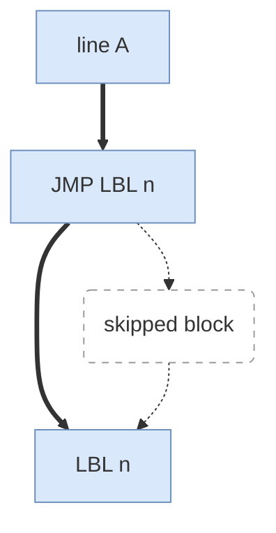

# LBL, JMP LBL, and IF (not GOTO)

> Status: reviewed  
> Brand: FANUC  
> Mode: programmer, learner  
> Track: 01 HandlingTool  
> Practice: `practice/fanuc/013-lbl-jmp`  
> Pendant: curriculum pass only — confirm menus on your software; not a cell verification

## Overview

HandlingTool **does not have a GOTO instruction**. Branching is **`LBL[n]`** plus **`JMP LBL[n]`** or **`IF … JMP LBL[n]`**. Unconditional JMP with no exit loops forever in Auto.

## When to use

- Skip a block (error path, optional motion)
- Counted loops with R[] (union: [`006`](../../../practice/fanuc/006-loop-call/))
- Timeout branch (union: [`007`](../../../practice/fanuc/007-wait-gripper/))

## Definition

```text
JMP LBL[20]
LBL[20]
IF R[1]<R[2],JMP LBL[50]
```

Message / remark do not replace a label. CALL leaves this program; JMP stays in it.

## System



## Worked example

[`013-lbl-jmp`](../../../practice/fanuc/013-lbl-jmp/): JMP over a remark block, then one Joint. No CALL.

## Practice

- Atom: [`013-lbl-jmp`](../../../practice/fanuc/013-lbl-jmp/)
- Unions: [`006-loop-call`](../../../practice/fanuc/006-loop-call/), [`007-wait-gripper`](../../../practice/fanuc/007-wait-gripper/)

## Common mistakes

- Looking for GOTO on the instruction menu
- JMP to a missing LBL
- Loop with no increment / no IF exit

## Safety notes

A JMP loop in Auto will not “time out” by itself. Site SOP and OEM manuals override this page.

## Official references

On manuals **licensed to your site**: JMP, LBL, IF. Do not paste OEM pages here.

## Repo references

- [`registers-jumps-call.md`](registers-jumps-call.md)
- [`logic-skip.md`](logic-skip.md)
- [`../topic-map.md`](../topic-map.md)

## Rights

See [`LEGAL.md`](../../../LEGAL.md): FANUC retains all rights. Educational use; own consent and risk.
