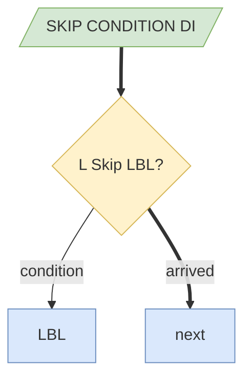

# SKIP CONDITION

> Status: reviewed  
> Brand: FANUC  
> Mode: programmer, learner  
> Track: 01 HandlingTool  
> Practice: `practice/fanuc/016-skip-linear`

## Overview

**SKIP CONDITION** arms a digital (or other) condition. A following motion can **Skip,LBL[n]** if that condition becomes true **during** the move. Use it to leave a path early (part present, search, “air move until sensor”). Exact menu words vary by software — look them up on your pendant.

## When to use

- Stop a Linear early when a DI (placeholder) turns on
- Not for: safety fence / DCS — those are not SKIP
- Not for: replacing a WAIT at a stopped pose (use WAIT)

## Definition

Study shape (confirm on your controller):

```text
SKIP CONDITION DI[1]=ON
L P[2] 200mm/sec FINE Skip,LBL[10]
LBL[10]
```

DI[1] is a **placeholder**. Map on the cell. After skip, you are at the pose where skip fired, not necessarily P[2].

## System



## Worked example

[`016-skip-linear`](../../../practice/fanuc/016-skip-linear/). Application notes: [`../applications/skip-and-contour.md`](../applications/skip-and-contour.md).

## Practice

[`016-skip-linear`](../../../practice/fanuc/016-skip-linear/)

## Common mistakes

- Using SKIP as an e-stop
- Forgetting to set SKIP CONDITION before the motion
- Assuming the TCP is at the destination after a skip

## Safety notes

Prove in T1 at low override. Site SOP and OEM manuals override this page.

## Official references

On manuals **licensed to your site**: SKIP CONDITION, Skip jump. Do not paste OEM pages here.

## Repo references

- [`logic-lbl-jmp.md`](logic-lbl-jmp.md)
- [`motion-l.md`](motion-l.md)

## Rights

See [`LEGAL.md`](../../../LEGAL.md): FANUC retains all rights. Educational use; own consent and risk.
