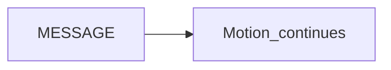

# MESSAGE (does not halt)

> Status: reviewed  
> Brand: FANUC  
> Mode: programmer, learner  
> Track: 01 HandlingTool  
> Practice: `practice/fanuc/021-message`

## Overview

A **MESSAGE** (user message / message instruction — confirm the pendant name) **displays text and does not stop** the program the way **UALM** does. Use it to inform. Use **UALM** when the cycle must not continue.

## When to use

- “Picking nest 3” while motion continues
- Not for: missing-part faults
- Exact syntax varies; look it up on your software

## Definition

Study shape (confirm on controller): a MESSAGE line, then motion. If the menu word differs (Message vs CALL to a message macro), still: **inform vs fault**.

## System

## Worked example

[`021-message`](../../../practice/fanuc/021-message/). Contrast [`020-user-alarm`](../../../practice/fanuc/020-user-alarm/).

## Practice

[`021-message`](../../../practice/fanuc/021-message/)

## Common mistakes

- Expecting MESSAGE to Hold the robot
- Putting safety text only in MESSAGE with no UALM / interlock

## Safety notes

MESSAGE is not a safety function. Site SOP and OEM manuals override this page.

## Official references

On manuals **licensed to your site**: Message instruction. Do not paste OEM pages here.

## Repo references

- [`ualm.md`](ualm.md)
- [`registers-jumps-call.md`](registers-jumps-call.md)

## Rights

See [`LEGAL.md`](../../../LEGAL.md): FANUC retains all rights. Educational use; own consent and risk.
