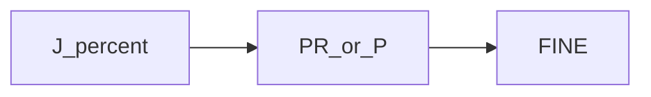

# Joint motion (J) only

> Status: reviewed  
> Brand: FANUC  
> Mode: programmer, learner  
> Track: 01 HandlingTool  
> Practice: `practice/fanuc/011-joint-only`  
> Pendant: curriculum pass only — confirm menus on your software; not a cell verification

## Overview

**J** moves in **axis space**. Feed is **percent** of joint speed. Use it to fly through free space and to a taught home. Do not use J to scrape along a fixture — that is Linear.

## When to use

- Home, approach in air, recovery
- When Cartesian straight-line is not required
- Not for: process along a part edge (use L)

## Definition

`J PR[n] 20% FINE` — Joint to a position register, 20 percent, stop FINE. Union with Linear: [`002-square-path`](../../../practice/fanuc/002-square-path/).

## System

## Worked example

[`011-joint-only`](../../../practice/fanuc/011-joint-only/): Joint to PR[1], then PR[2], FINE each. Then study the union [`002`](../../../practice/fanuc/002-square-path/).

## Practice

- Atom: [`011-joint-only`](../../../practice/fanuc/011-joint-only/)
- Union: [`002-square-path`](../../../practice/fanuc/002-square-path/), [`001-home-safe`](../../../practice/fanuc/001-home-safe/)

## Common mistakes

- Linear through a clamp because Joint “looked slower”
- High percent beside a fixture

## Safety notes

Prove in T1. Site SOP and OEM manuals override this page.

## Official references

On manuals **licensed to your site**: Joint motion, termination. Do not paste OEM pages here.

## Repo references

- [`motion-l.md`](motion-l.md)
- [`motion-types-fine-cnt.md`](motion-types-fine-cnt.md)
- [`../topic-map.md`](../topic-map.md)

## Rights

See [`LEGAL.md`](../../../LEGAL.md): FANUC retains all rights. Educational use; own consent and risk.
