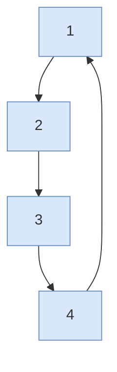
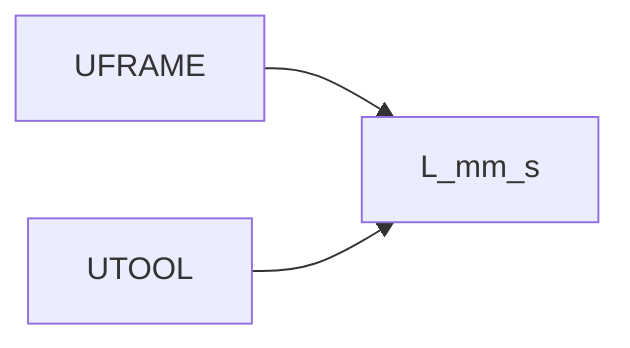

# Linear motion (L) only

> Status: reviewed  
> Brand: FANUC  
> Mode: programmer, learner  
> Track: 01 HandlingTool  
> Practice: `practice/fanuc/012-linear-only`  
> Pendant: curriculum pass only — confirm menus on your software; not a cell verification

## Overview

**L** moves the **TCP in a straight line** in the current UFRAME/UTOOL. Feed is typically **mm/s** (or inch/s). Use FINE to stop; CNT to round a corner after the path is proven.

## When to use

- Process along a part, insert, place
- Not for: long fly-over through unknown air (prefer J)

## Definition

`L P[2] 200mm/sec FINE` — Linear to P[2]. Wrong UTOOL/UFRAME puts the line in the wrong place.

## Path / origin

Study sketch in **UFRAME**. **L** is a straight TCP segment. Corners **1-2-3-4** stop **FINE** before the next side.

Joint fly-in to this square: [`002`](../../../practice/fanuc/002-square-path/). OFFSET of this square: [`005`](../../../practice/fanuc/005-offset-path/) (then **1'-2'-3'-4'**).

## System

## Worked example

[`012-linear-only`](../../../practice/fanuc/012-linear-only/): Linear between taught points only (no J). Contrast with [`002`](../../../practice/fanuc/002-square-path/) which adds Joint fly-in.

## Practice

- Atom: [`012-linear-only`](../../../practice/fanuc/012-linear-only/)
- Union: [`002-square-path`](../../../practice/fanuc/002-square-path/), [`019-contour-plot`](../../../practice/fanuc/019-contour-plot/)

## Common mistakes

- Linear from a folded Joint pose through the fixture
- CNT 100 on first prove-out

## Safety notes

Prove FINE in T1 before CNT. Site SOP and OEM manuals override this page.

## Official references

On manuals **licensed to your site**: Linear motion, speed units, FINE/CNT. Do not paste OEM pages here.

## Repo references

- [`motion-j.md`](motion-j.md)
- [`motion-types-fine-cnt.md`](motion-types-fine-cnt.md)
- [`../io-frames-tools/frames.md`](../io-frames-tools/frames.md)

## Rights

See [`LEGAL.md`](../../../LEGAL.md): FANUC retains all rights. Educational use; own consent and risk.
