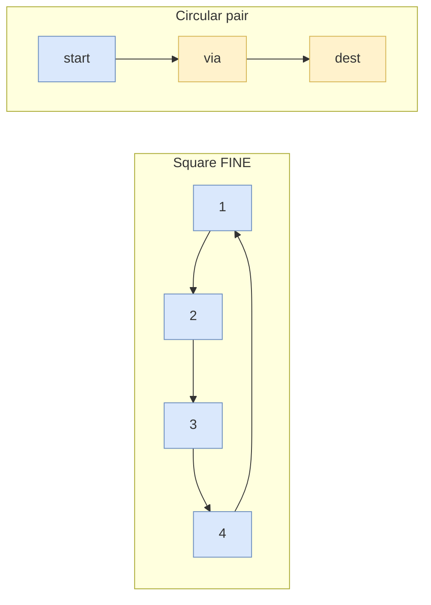
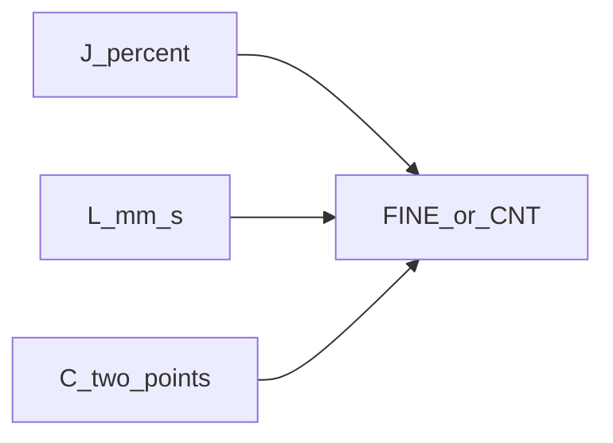

# J, L, C, A — FINE and CNT

> Status: reviewed  
> Brand: FANUC  
> Mode: programmer, learner  
> Track: 01 HandlingTool  
> Practice: `practice/fanuc/002-square-path`, `practice/fanuc/003-circular-path`

## Overview

Square: Joint in, Linear around, Joint home — **union** of [`motion-j.md`](motion-j.md) and [`motion-l.md`](motion-l.md). Circle: each Circular instruction uses a via and a destination. **FINE** stops; **CNT n** rounds the corner (n ≈ 1–100).

## When to use

- FINE when the next instruction needs a stopped TCP (wait, gripper, turn)
- CNT when a continuous sweep is safe

## Definition

**INC** on a motion treats the recorded pose as an increment after you edit the index. Wrist W/P/R apply in World.

## Path / origin

Study sketch. Square union: **J** into the work, **L** around **1-2-3-4** FINE, **J** home. Circular: each **C** needs a **via** and a **dest**.

## System

## Worked example

[`002-square-path`](../../../practice/fanuc/002-square-path/) (FINE corners). [`003-circular-path`](../../../practice/fanuc/003-circular-path/) (C segments). Variant: replace FINE with CNT 100 at low override.

## Practice

[`002`](../../../practice/fanuc/002-square-path/), [`003`](../../../practice/fanuc/003-circular-path/), [`004`](../../../practice/fanuc/004-incremental-box/).

## Common mistakes

- Circular with only one `P[]`
- CNT near a fixture at 100% override

## Safety notes

First prove FINE, then introduce CNT.

## Official references

On manuals **licensed to your site**: motion instructions, FINE/CNT, circular teaching. Do not paste OEM pages here.

## Repo references

- [`motion-j.md`](motion-j.md)
- [`motion-l.md`](motion-l.md)
- [`offset-and-incremental.md`](offset-and-incremental.md)
- [`../topic-map.md`](../topic-map.md)

## Rights

See [`LEGAL.md`](../../../LEGAL.md): FANUC retains all rights. Educational use; own consent and risk.
