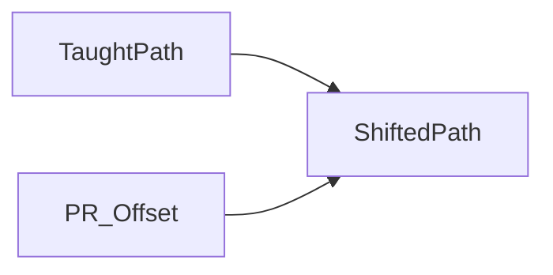

# OFFSET and INC

> Status: draft  
> Brand: FANUC  
> Mode: programmer, learner

## Overview

**INC** edits known XYZWPR deltas on Linear lines. **OFFSET CONDITION PR[n]** then **OFFSET** on following motions shifts a taught path. The class pattern does not mix OFFSET with INC.

## When to use

- INC: known pitch, avoid re-jogging every corner
- OFFSET: same path, family of parts / nested rows

## Definition

Set PR via Data → Position Register. Instruction: OFFSET/FRAMES → OFFSET CONDITION.

## System

## Worked example

[`004-incremental-box`](../../../practice/fanuc/004-incremental-box/), [`005-offset-path`](../../../practice/fanuc/005-offset-path/), [`008-pr-lpos`](../../../practice/fanuc/008-pr-lpos/) (`PR[1]=LPOS` then element math).

## Practice

Those three problem ids.

## Common mistakes

- OFFSET on INC lines
- Forgetting to teach PR[1] as the shift

## Safety notes

Prove offset in T1 away from people.

## Official references

On manuals **licensed to your site**: the operator / HandlingTool chapter for this topic. Do not paste OEM pages here.

## Repo references

- [`motion-types-fine-cnt.md`](motion-types-fine-cnt.md)

## Rights, education, and consent

FANUC retains **all rights** in its trademarks, software, and manuals. See [`LEGAL.md`](../../../LEGAL.md).

This page and any linked programs are **educational and study-aid only**. Use at **your own consent and risk**. Garry TJ / this repo are not FANUC and offer no warranty.
