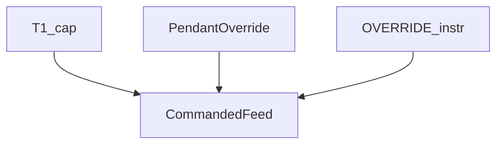

# Override (pendant vs instruction)

> Status: reviewed  
> Brand: FANUC  
> Mode: programmer, operator, learner  
> Track: 01 HandlingTool  
> Practice: `practice/fanuc/015-override-instr`

## Overview

**Pendant / panel override** scales programmed speed while you teach and prove. The **`OVERRIDE` instruction** can set a percent from the program. **Neither is a safety device.** T1 still caps TCP speed. E-stop, Hold, fence, and DCS still apply.

## When to use

- Pendant override low for first T1
- Instruction: a study/demo of programmed percent — **not** to defeat T1 or a collaborative limit
- Not for: replacing SOP speed or DCS

## Definition

Study shape (confirm on your controller):

```text
OVERRIDE=50%
J P[1] 100% FINE
```

The Joint **100%** is still scaled by override and by mode. Look up the exact instruction name on your software.

## System



## Worked example

[`015-override-instr`](../../../practice/fanuc/015-override-instr/): set OVERRIDE, one Joint FINE. Then turn pendant override down and step again — you should still be slow.

## Practice

[`015-override-instr`](../../../practice/fanuc/015-override-instr/)

## Common mistakes

- Thinking OVERRIDE bypasses T1
- 100% pendant override on a CNT path beside a clamp

## Safety notes

Site SOP and OEM manuals override this page.

## Official references

On manuals **licensed to your site**: override key, OVERRIDE instruction, T1 speed. Do not paste OEM pages here.

## Repo references

- [`../safety-dcs/modes-t1-t2-auto.md`](../safety-dcs/modes-t1-t2-auto.md)
- [`motion-j.md`](motion-j.md)

## Rights, education, and consent

FANUC retains **all rights** in its trademarks, software, and manuals. See [`LEGAL.md`](../../../LEGAL.md).

This page and any linked programs are **educational and study-aid only**. Use at **your own consent and risk**. Garry TJ / this repo are not FANUC and offer no warranty.
