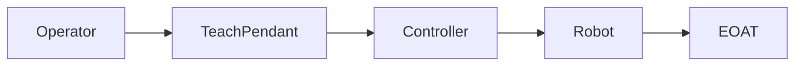
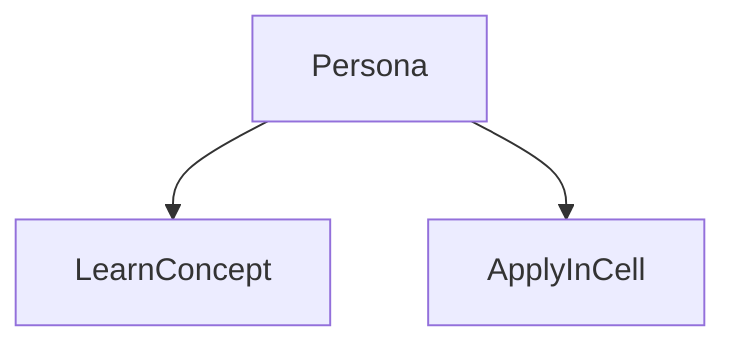
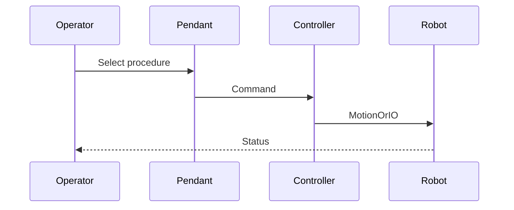

# Teach Pendant programming

> Status: stub  
> Brand: FANUC  
> Personas: student, operator, programmer, integrator  
> Related programs: `programs/fanuc/samples/`

## Overview

TP (Teach Pendant) programs are the usual production language: motion lines, registers, I/O, calls, condition handlers. ASCII `.ls` in this repo is a documentation form, not a guaranteed controller load file.

## Definition

**TP program**: sequenced instructions taught or typed on the pendant. Related sample: `programs/fanuc/samples/HOME_SAFE.ls`.

## System

## Use cases

## Sequence

## Safety notes

- OEM manuals and site rules override this stub.
- Validate on a teach pendant in a controlled cell.

## Official references

- FANUC handling tool / operator manual: `[OFFICIAL_URL]`
- Software version: `[CONTROLLER_SOFT_VERSION]`

## Repo references

- Index: [`../README.md`](../README.md)
- Template: [`../../_templates/topic.md`](../../_templates/topic.md)
- Sample program: [`../../../programs/fanuc/samples/HOME_SAFE.ls`](../../../programs/fanuc/samples/HOME_SAFE.ls)

## TODO

- Expand from reviewed notes in `inbox/pdf/` and licensed manuals (link, do not paste).
