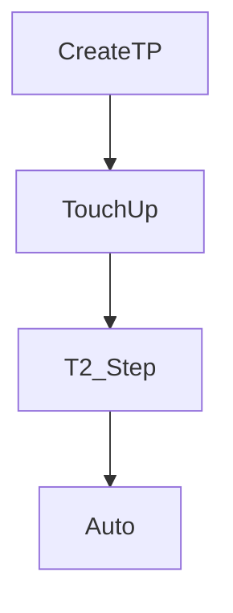

# Teach Pendant programming

> Status: draft  
> Brand: FANUC  
> Mode: programmer, learner

## Overview

Create: Select → F2 Create → uppercase name → Edit. EDCMD covers insert, delete, one-level undo, paste position / position ID / logic, renumber, replace, remark.

## When to use

- Production handling logic on HandlingTool
- Class drills in `practice/fanuc/`

## Definition

**Paste position** — points into another program. **Paste position ID** — same `P[]` numbers in the same program. **Paste logic** — instructions; you assign numbers. Git `.ls` is documentation, not a guaranteed load file.

## System

## Worked example

Create `SQUARE`, teach P[1]–P[5], T2 step, then compare [`002-square-path`](../../../practice/fanuc/002-square-path/).

## Practice

Full set: [`practice/fanuc/`](../../../practice/fanuc/).

## Common mistakes

- Assuming more than one undo
- CALL without agreeing register maps between MAIN and SUB

## Safety notes

ASCII listings omit taught `/POS` data until you save from a real robot.

## Official references

- HandlingTool / operator manuals: `[OFFICIAL_URL]`

## Repo references

- Child articles in this folder

## Rights, education, and consent

FANUC retains **all rights** in its trademarks, software, and manuals. See [`LEGAL.md`](../../../LEGAL.md).

This page and any linked programs are **educational and study-aid only**. Use at **your own consent and risk**. Garry TJ / this repo are not FANUC and offer no warranty.
