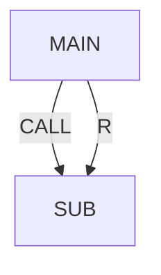

# Registers, JMP LBL, CALL, timer, alarm

> Status: reviewed  
> Brand: FANUC  
> Mode: programmer, learner  
> Track: 01 HandlingTool  
> Practice: `practice/fanuc/006-loop-call`, `practice/fanuc/010-main-call`

## Overview

Numeric **R[]**, **LBL / JMP / IF**, **CALL**, **UALM**, and **TIMER** used to live only on this page. Study the **atoms** first, then come back here for CALL + timer + alarm as a **union**.

- JMP/LBL (not GOTO): [`logic-lbl-jmp.md`](logic-lbl-jmp.md)
- R[] only: [`registers-numeric.md`](registers-numeric.md)
- OVERRIDE: [`override.md`](override.md)

## When to use

- Repeat a motion N times
- Timeout plus alarm/abort
- Cycle-time measurement

## Definition

Register count is software-dependent. Message instruction does not halt. Programmed speed scale: [`override.md`](override.md).

## System

## Worked example

[`007-wait-gripper`](../../../practice/fanuc/007-wait-gripper/) for WAIT TIMEOUT → UALM → ABORT. Atom: [`ualm.md`](ualm.md), [`020`](../../../practice/fanuc/020-user-alarm/). MESSAGE does not halt: [`message.md`](message.md), [`021`](../../../practice/fanuc/021-message/). Cell-style main: [`010-main-call`](../../../practice/fanuc/010-main-call/).

## Practice

`006`, `007`, `010`.

## Common mistakes

- Unconditional JMP with no exit in Auto
- CALL without a matching sub name on the controller

## Safety notes

In T1/T2, releasing Shift stops motion; in Auto you need e-stop or Hold by design.

## Official references

On manuals **licensed to your site**: the operator / HandlingTool chapter for this topic. Do not paste OEM pages here.

## Repo references

- [`logic-lbl-jmp.md`](logic-lbl-jmp.md)
- [`registers-numeric.md`](registers-numeric.md)
- [`../io-frames-tools/io-classes.md`](../io-frames-tools/io-classes.md)

## Rights

See [`LEGAL.md`](../../../LEGAL.md): FANUC retains all rights. Educational use; own consent and risk.
