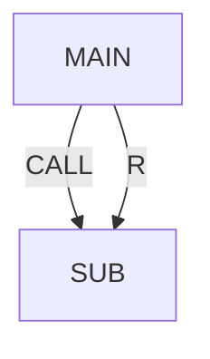

# Registers, JMP LBL, CALL, timer, alarm

> Status: draft  
> Brand: FANUC  
> Mode: programmer, learner

## Overview

Numeric registers for counters and limits; `LBL` / `JMP LBL`; `IF R[] … JMP`; **CALL** with data via registers; **UALM**; retentive **TIMER** RESET/START/STOP.

## When to use

- Repeat a motion N times
- Timeout plus alarm/abort
- Cycle-time measurement

## Definition

Register count is software-dependent (class: on the order of 200). Message instruction does not halt. Override instruction sets feedrate override.

## System

## Worked example

[`006-loop-call`](../../../practice/fanuc/006-loop-call/) plus a motion sub. [`007-wait-gripper`](../../../practice/fanuc/007-wait-gripper/) for WAIT TIMEOUT → UALM → ABORT.

## Practice

`006`, `007`.

## Common mistakes

- Unconditional JMP with no exit in Auto
- CALL without a matching sub name on the controller

## Safety notes

In T1/T2, releasing Shift stops motion; in Auto you need e-stop or Hold by design.

## Official references

- HandlingTool / operator manuals: `[OFFICIAL_URL]`

## Repo references

- [`../io-frames-tools/io-classes.md`](../io-frames-tools/io-classes.md)

## Rights, education, and consent

FANUC retains **all rights** in its trademarks, software, and manuals. See [`LEGAL.md`](../../../LEGAL.md).

This page and any linked programs are **educational and study-aid only**. Use at **your own consent and risk**. Garry TJ / this repo are not FANUC and offer no warranty.
