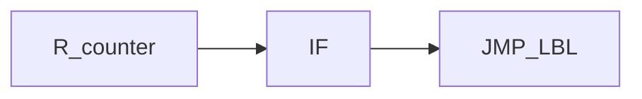

# Numeric registers R[]

> Status: reviewed  
> Brand: FANUC  
> Mode: programmer, learner  
> Track: 01 HandlingTool  
> Practice: `practice/fanuc/006-loop-call`

## Overview

**R[n]** holds a **number** (counter, limit, flag). It is not a pose. Poses are **P[]** (in the program) or **PR[]** (position register). See [`../io-frames-tools/pr-vs-r.md`](../io-frames-tools/pr-vs-r.md).

## When to use

- Loop counts: `R[1]=R[1]+1` then `IF R[1]<R[2],JMP LBL[50]`
- Passing a count into a CALL (agree the R numbers in remarks)
- Not for: storing XYZ — use PR

## Definition

How many R[] exist depends on software. Do not copy a count from memory. TIMER is separate (see CALL article).

## System

## Worked example

[`006-loop-call`](../../../practice/fanuc/006-loop-call/). Pallet rows×cols: [`018-pallet-grid`](../../../practice/fanuc/018-pallet-grid/).

## Practice

- [`006-loop-call`](../../../practice/fanuc/006-loop-call/)
- [`018-pallet-grid`](../../../practice/fanuc/018-pallet-grid/)

## Common mistakes

- Using R[] as if it were PR[]
- Loop with no increment

## Safety notes

Site SOP and OEM manuals override this page.

## Official references

On manuals **licensed to your site**: registers, IF. Do not paste OEM pages here.

## Repo references

- [`logic-lbl-jmp.md`](logic-lbl-jmp.md)
- [`registers-jumps-call.md`](registers-jumps-call.md)

## Rights, education, and consent

FANUC retains **all rights** in its trademarks, software, and manuals. See [`LEGAL.md`](../../../LEGAL.md).

This page and any linked programs are **educational and study-aid only**. Use at **your own consent and risk**. Garry TJ / this repo are not FANUC and offer no warranty.
