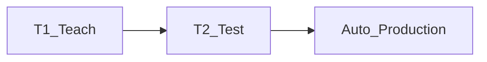

# T1, T2, Auto, SOP and UOP

> Status: draft  
> Brand: FANUC  
> Mode: operator, programmer, learner

## Overview

Teach in **T1**, test in **T2** (step), produce in **Auto**. T1 is associated with ≤ 250 mm/s and pendant control. Auto runs from the operator panel with fence interlocks.

## When to use

- Every teach and prove-out
- Explaining why releasing Shift/deadman stops T1/T2 but Auto needs e-stop/Hold

## Definition

**SOP** — standard operator panel I/O. **UOP** — user/peripheral panel (remote start, PNS/RSR).

## System

## Worked example

Programmer: deadman + Shift, teach in T1, T2 step through [`002-square-path`](../../practice/fanuc/002-square-path/), then Auto only with fence closed.

## Practice

[`001-home-safe`](../../practice/fanuc/001-home-safe/) at low joint override.

## Common mistakes

- Testing CNT paths at 100% override in T1 near fixtures
- Entering the fence while the robot can move

## Safety notes

Maintenance: lock power; wait until cabinet **D7** LED is off before servo work; do not remove the mechanical-unit battery in a way that drops mastering (follow the cabinet procedure).

## Official references

- HandlingTool / operator manuals: `[OFFICIAL_URL]`

## Repo references

- [`../controller-pendant/teach-pendant.md`](../controller-pendant/teach-pendant.md)
- [`../io-frames-tools/io-classes.md`](../io-frames-tools/io-classes.md)

## Rights, education, and consent

FANUC retains **all rights** in its trademarks, software, and manuals. See [`LEGAL.md`](../../../LEGAL.md).

This page and any linked programs are **educational and study-aid only**. Use at **your own consent and risk**. Garry TJ / this repo are not FANUC and offer no warranty.
