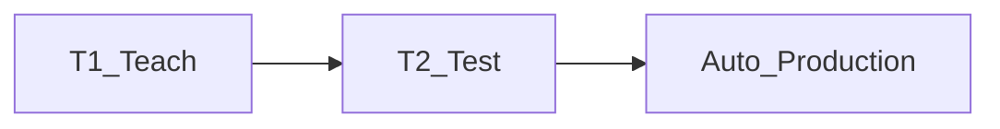

# T1, T2, Auto, SOP and UOP

> Status: reviewed  
> Brand: FANUC  
> Mode: operator, programmer, learner  
> Track: 01 HandlingTool  
> Practice: `practice/fanuc/001-home-safe`  
> Pendant: curriculum pass only — confirm menus on your software; not a cell verification

## Overview

Teach in **T1**, prove in **T2** (often with Step), produce in **Auto** only when the cell is safe (fence / collaborative limits per SOP). T1 uses pendant enable (deadman + Shift) and a **reduced** TCP speed — commonly cited as ≤ 250 mm/s; **confirm on your controller**. Auto typically starts from the operator panel with interlocks, not from a casual pendant start.

## When to use

- Teach and first prove-out: T1
- Path verification with Step: T2
- Production after SOP sign-off: Auto
- Explaining why releasing Shift/deadman stops teach modes, while Auto needs Hold / e-stop / fence

## Definition

**SOP** — standard operator panel signals. **UOP** — peripheral / remote (cycle, hold, safety speed, program select related bits). Map UOP on **your** interconnect; do not copy numbers from this repo.

Remote vs Local (System Config) chooses PLC vs pendant as the start source.

## System

## Worked example

Deadman + Shift, teach in T1, T2 step [`002-square-path`](../../../practice/fanuc/002-square-path/), Auto only with the fence closed (industrial) or collaborative limits enabled (cobot). Recovery: [`../motion-paths-home/jog-and-recovery.md`](../motion-paths-home/jog-and-recovery.md).

## Practice

[`001-home-safe`](../../../practice/fanuc/001-home-safe/) at low joint override. After a understood stop: [`../../../practice/fanuc/009-fault-home/`](../../../practice/fanuc/009-fault-home/).

## Common mistakes

- CNT paths at 100% override in T1 near fixtures
- Entering the fence while the robot can move
- Auto start while still in Local/pendant-only config (or the reverse)

## Safety notes

Maintenance: lock power; follow the cabinet procedure (including status LEDs) before servo work; battery / mastering is OEM-only. This page is not a LOTO procedure.

## Official references

On manuals **licensed to your site**: mode select, T1/T2/Auto, SOP/UOP, fence / safety I/O. Confirm T1 speed for your software.

## Repo references

- [`../controller-pendant/teach-pendant.md`](../controller-pendant/teach-pendant.md)
- [`../io-frames-tools/io-classes.md`](../io-frames-tools/io-classes.md)
- [`../alarms/overview.md`](../alarms/overview.md)

## Rights

See [`LEGAL.md`](../../../LEGAL.md): FANUC retains all rights. Educational use; own consent and risk.
