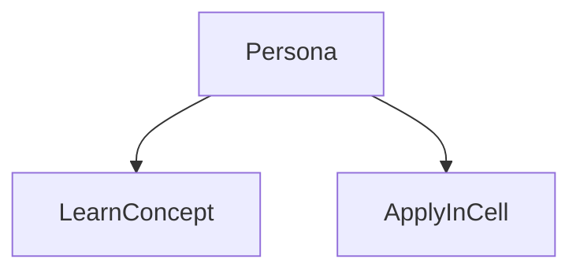
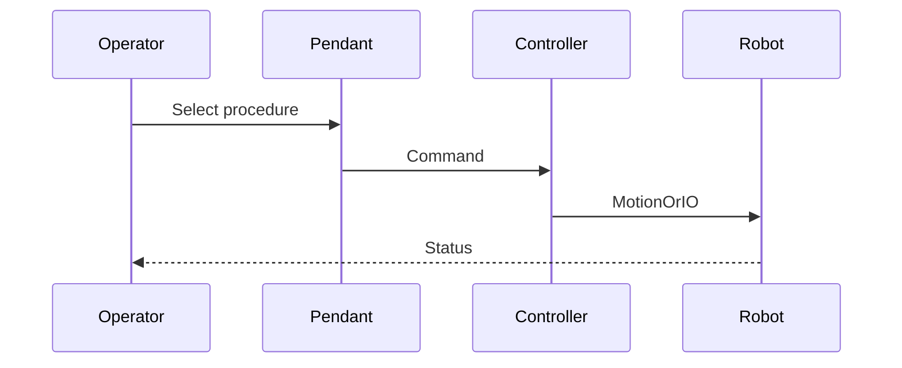

# Safety and DCS

> Status: stub  
> Brand: FANUC  
> Personas: student, operator, programmer, integrator  
> Related programs: `programs/fanuc/samples/`

## Overview

Dual Check Safety (DCS) and collaborative limits restrict position, speed, and tool zones. Industrial cells usually add fencing and e-stops. This page does not replace a safety PLC or risk assessment.

## Definition

**DCS**: FANUC safety software that monitors position/speed/zones. **Collaborative limits**: power and force related settings on cobots. Both must be commissioned, not copied from samples.

## System

## Use cases

## Sequence

## Safety notes

- OEM manuals and site rules override this stub.
- Never copy DCS parameters from a sample into a production cell.

## Official references

- FANUC handling tool / operator manual: `[OFFICIAL_URL]`
- Software version: `[CONTROLLER_SOFT_VERSION]`

## Repo references

- Index: [`../README.md`](../README.md)
- Template: [`../../_templates/topic.md`](../../_templates/topic.md)
- Sample program: [`../../../programs/fanuc/samples/HOME_SAFE.ls`](../../../programs/fanuc/samples/HOME_SAFE.ls)

## TODO

- Expand from reviewed notes in `inbox/pdf/` and licensed manuals (link, do not paste).
