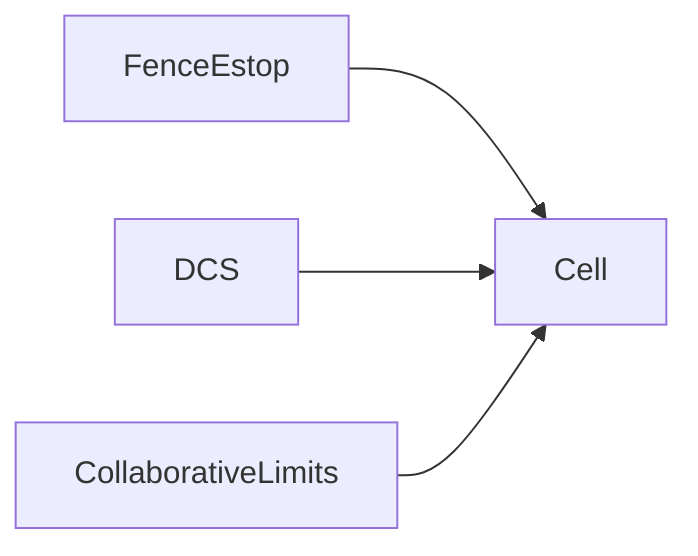

# Safety and DCS

> Status: draft  
> Brand: FANUC  
> Mode: integrator, operator, programmer

## Overview

Track 01 covers fence, interlock, e-stop, T1 speed, and deadman. **DCS** (Dual Check Safety) is a separate topic.

## When to use

- Cell safeguarding design
- Before copying any “safety numbers” from samples (never do that)

## Definition

DCS monitors position, speed, and zones in the safety channel. Collaborative force limits are another commissioning path.

## System

## Worked example

Lockout, confirm D7 LED off, then maintenance. Programming drills stay motion/I/O only.

## Practice

[`001-home-safe`](../../practice/fanuc/001-home-safe/).

## Common mistakes

- Pasting DCS parameters from a study repo into production

## Safety notes

Samples contain **no** DCS data.

## Official references

On manuals **licensed to your site**: the operator / HandlingTool chapter for this topic. Do not paste OEM pages here.

## Repo references

- [`modes-t1-t2-auto.md`](modes-t1-t2-auto.md)

## Rights, education, and consent

FANUC retains **all rights** in its trademarks, software, and manuals. See [`LEGAL.md`](../../../LEGAL.md).

This page and any linked programs are **educational and study-aid only**. Use at **your own consent and risk**. Garry TJ / this repo are not FANUC and offer no warranty.
